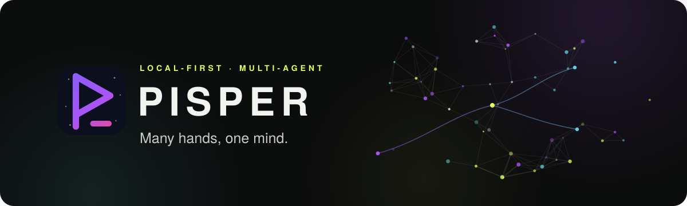
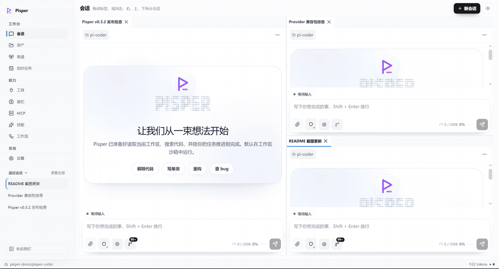
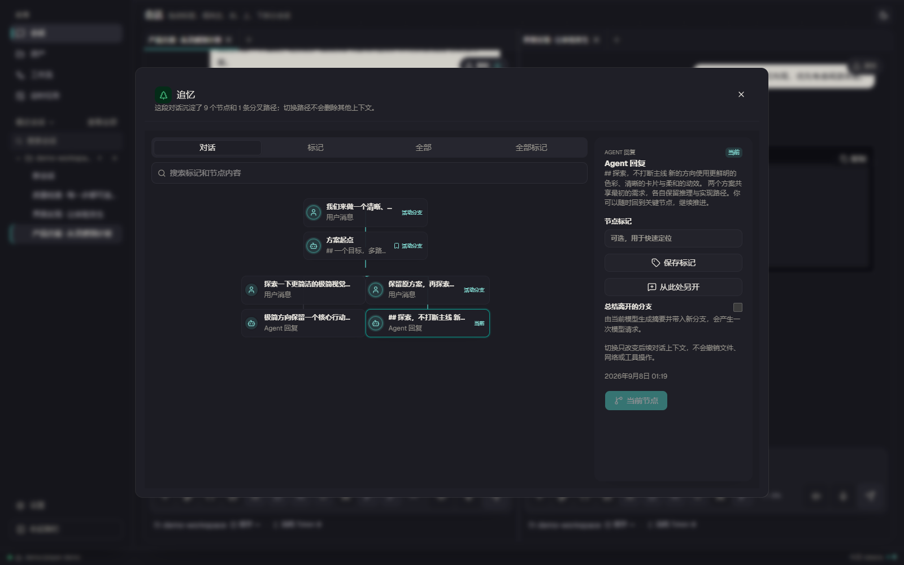
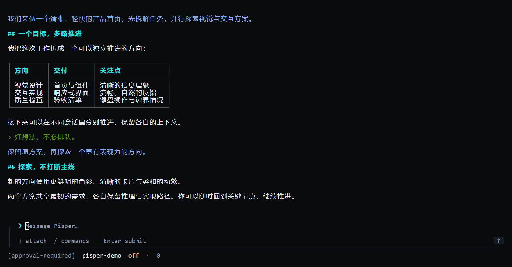

<p align="right"><a href="./README.md">简体中文</a> · <strong>English</strong></p>

<a id="top"></a>

<p align="center">
  
</p>

<p align="center">
  A local-first multi-agent app. Branch your thinking the way you branch code — grow a new session from any completed Turn, run branches in parallel, and keep everything on your machine.
</p>

<p align="center">
  <a href="https://github.com/ling-kong-ran/pisper/releases"></a>
  <a href="https://github.com/ling-kong-ran/pisper/stargazers"></a>
  <a href="./LICENSE"></a>
  
  
</p>

<p align="center">
  <a href="https://github.com/ling-kong-ran/pisper/releases/latest">
    
  </a>
</p>

<p align="center">
  <a href="https://ling-kong-ran.github.io/pisper/">Website</a> ·
  <a href="#quickstart">Quick start</a> ·
  <a href="#features">Feature map</a> ·
  <a href="#data-safety">Data safety</a> ·
  <a href="./README.md">简体中文</a>
</p>

<p align="center">
  
</p>

<a id="why"></a>

## ✨ Why Pisper

- **Branch conversations like code.** Spawn a new session from any completed Turn with full context, leaving the source untouched; stable Turn labels pin key moments as searchable anchors — like Git, but for agents.
- **Truly parallel agents.** Every session gets its own model, context, working directory and permissions. Drag tabs to split the view and watch them race.
- **Hot and cold tools.** Core tools live in context; plugins, MCP servers and skills are activated on demand through a discover/call gateway and retired when done — endless capability without stuffing the context like a junk drawer.
- **Stable prefix, hot cache.** Canonically ordered tool definitions and hash-based prompt-shape diagnostics keep provider prompt caches hitting — long sessions get faster and cheaper.
- **Missing a capability? Just ask.** Pisper writes, validates and installs local plugins by itself — callable from the very next turn.
- **Your data stays on your machine.** The runtime binds to 127.0.0.1 only, known secret formats are redacted, and inferred memories wait for your approval. Your context, your call.

<a id="features"></a>

## 🗺️ Feature map

| 🌿 Parallel & branching | 🧩 Extensibility |
| --- | --- |
| Split-view parallel sessions · Session Tree branching · Stable Turn labels · Ctrl+K cross-session jump · Per-session model/directory/permissions | Self-generated local plugins · MCP servers · Skill center · Multi-provider model configuration |
| **⚡ Automation & notifications** | **🖥️ Desktop & terminal, one core** |
| Visual workflows · Scheduled tasks · Feishu / WeChat channels · Project memory · Git & SVN changes | Ratatui TUI on the same runtime · Desktop pets (Petdex) · Independent Desktop / TUI / Runtime updates |

## 📸 Screenshots

<table>
  <tr>
    <td><a href="docs/shots/chat-grid.png"></a></td>
    <td><a href="docs/shots/session-tree.png"></a></td>
  </tr>
  <tr>
    <td align="center">Parallel sessions: drag tabs, split anywhere</td>
    <td align="center">Session Tree: resume any branch from a completed Turn</td>
  </tr>
  <tr>
    <td><a href="docs/shots/workflow-builder.png"></a></td>
    <td><a href="docs/shots/cli-chat.png"></a></td>
  </tr>
  <tr>
    <td align="center">Workflows: turn repeated work into pipelines</td>
    <td align="center">TUI: leave the desk, keep the context</td>
  </tr>
</table>

<a id="quickstart"></a>

## 🚀 Quick start

### Option 1: Desktop app (recommended)

Grab the installer for your platform from [Releases](https://github.com/ling-kong-ran/pisper/releases/latest). **TUI and Runtime are bundled — no Node.js required.**

<details>
<summary>macOS says the app "can't be opened"?</summary>

Pisper is not notarized by Apple yet. Make sure the installer came from the official Releases, then choose **Open Anyway** in **System Settings → Privacy & Security**. If that option is missing:

```bash
sudo xattr -rd com.apple.quarantine /Applications/Pisper.app
```

Only run this on an app downloaded from the official Releases and placed in `/Applications`.

</details>

<details>
<summary>Linux AppImage won't start?</summary>

```bash
chmod +x Pisper_*_linux_x86_64.AppImage
./Pisper_*_linux_x86_64.AppImage
```

If FUSE is missing, install `libfuse2` or `libfuse2t64`, or use the `.deb` instead:

```bash
sudo apt install ./Pisper-*-linux-amd64.deb
```

</details>

### Option 2: npm (Node.js 20+)

```bash
npm i -g pisper
pisper web   # open the Web UI and local configuration page
```

On first run, use `/provider` to pick a provider and configure an API key. Full commands, keybindings and approval modes: **[TUI Guide](./src-tui/README.md)**.

### Option 3: From source

<details>
<summary>Expand</summary>

Requires Node.js 20+, npm, and at least one model provider with an API key.

```bash
git clone https://github.com/ling-kong-ran/pisper.git
cd pisper
npm install
npm run dev
```

Desktop development and packaging:

```bash
npm run desktop:webview:dev
npm run desktop:webview:build
```

</details>

Data lives in `~/.pisper/agent` by default; override with `PISPER_AGENT_DIR`.

<a id="data-safety"></a>

## 🔒 Data safety

There is no "our cloud" in Pisper. Your data is held by the local runtime, and only the providers, MCP servers, search or channels you explicitly configure and call ever receive what a request needs.

- **Localhost only**: binds to 127.0.0.1 with a random startup token, restricted cookies and Origin checks on writes; Pi telemetry is off by default.
- **Redaction first**: common API keys, Bearer/JWT tokens, private keys and connection strings are replaced before memories are persisted or summaries are shown.
- **Permission boundaries**: read-only, full-access and approve-once modes; credentials are never echoed back to agents through ordinary config APIs, and the host shell strips common credential environment variables.
- **Memory on approval**: automatically inferred memories sit in a review queue and are never recalled until you confirm them.

> Honest boundary: redaction only recognizes common secret formats — it is not full DLP, a sandbox, or end-to-end encryption. Credentials currently live in the local agent data directory, not the OS keychain; protect that directory and its backups. Full details on the [website's data safety section](https://ling-kong-ran.github.io/pisper/#safety).

## 🧩 Components & independent updates

Desktop, TUI and Runtime are versioned, signed and updated independently, with automatic rollback to the bundled version on failure. The desktop app provides a single update entry — update exactly what needs updating, nothing more.

## 📚 Docs

- [Website](https://ling-kong-ran.github.io/pisper/) · product tour and screenshots
- [TUI Guide](./src-tui/README.md) · terminal install, commands and keybindings
- [Local plugins](./docs/local-plugins.md) · [Plugin authoring](./docs/plugin-authoring.md)
- [Desktop pets (Petdex)](./docs/petdex-integration.md)

<a id="development"></a>

## 🛠️ Development

Stack: React, TypeScript, Tauri, Rust, Node SEA and [Pi Coding Agent](https://github.com/earendil-works/pi/tree/main/packages/coding-agent).

```bash
npm run check   # typecheck + lint + i18n + format
npm test        # runtime tests
npm run build   # production build
```

[Issues](https://github.com/ling-kong-ran/pisper/issues) and [Pull Requests](https://github.com/ling-kong-ran/pisper/pulls) are welcome. Never commit API keys, bot credentials, or personal data from `~/.pisper/agent`.

## 🙏 Acknowledgements

Thanks to [Pi Coding Agent](https://github.com/earendil-works/pi/tree/main/packages/coding-agent), [Petdex](https://petdex.dev), and the open-source software this project builds on.

Contributors:

- [@mik-myp](https://github.com/mik-myp) — frontend TypeScript architecture, shadcn/ui / AI Elements, Zustand and i18n refactor ([#1](https://github.com/ling-kong-ran/pisper/pull/1))

<a id="sponsors"></a>

## ❤️ Sponsors

<details>
<summary>View sponsors</summary>

<table>
<tr>
<td width="180" align="center">
  <a href="https://matrix.000328.xyz/sign-up?aff=ZPeH"><strong>Matrix</strong></a>
</td>
<td>
Thanks to <a href="https://matrix.000328.xyz/sign-up?aff=ZPeH">Matrix</a> for supporting the Pisper community. Signing up via <a href="https://matrix.000328.xyz/sign-up?aff=ZPeH">this link</a> may generate referral revenue for the project.
</td>
</tr>
</table>

> Sponsor links carry referral parameters. Pisper sponsorship placement never uses sessions, projects, providers, models or API configurations for targeting, and never sends such data to sponsors. The public placement config lives in [`docs/sponsors.json`](./docs/sponsors.json).

</details>

If you'd like to appear here, reach us via an [Issue](https://github.com/ling-kong-ran/pisper/issues).

---

<p align="center">
  <strong>If Pisper helps you, a ⭐ means the world — it's what keeps the project growing.</strong><br />
  <sub>Share it with anyone who uses coding agents as a serious productivity tool.</sub>
</p>

<p align="center">
  <a href="./LICENSE">MIT License</a> · © Pisper Contributors ·
  <a href="#top">Back to top ↑</a>
</p>
