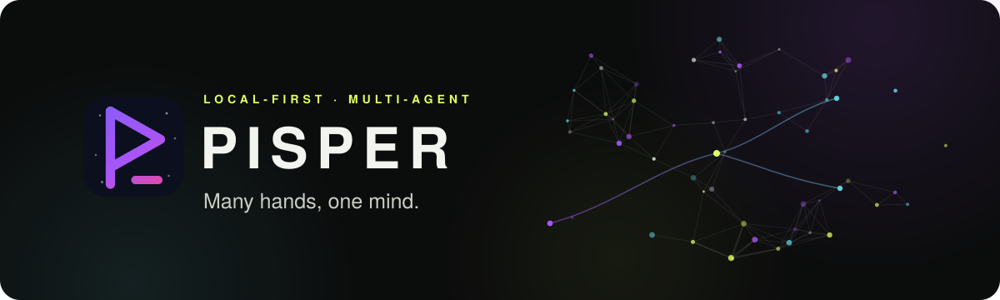
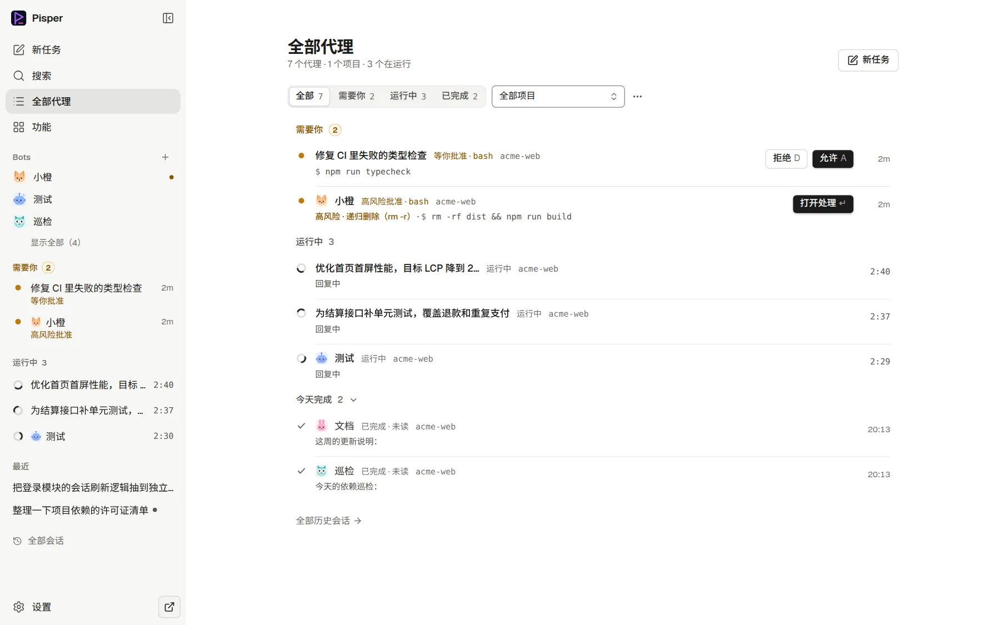
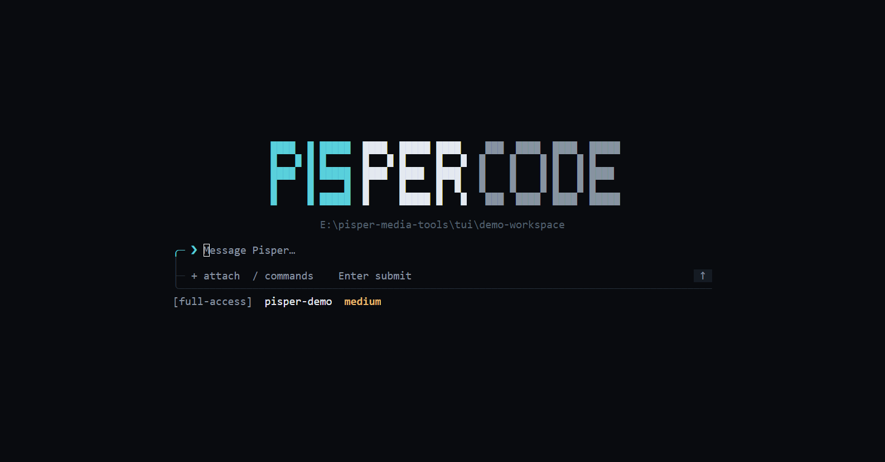
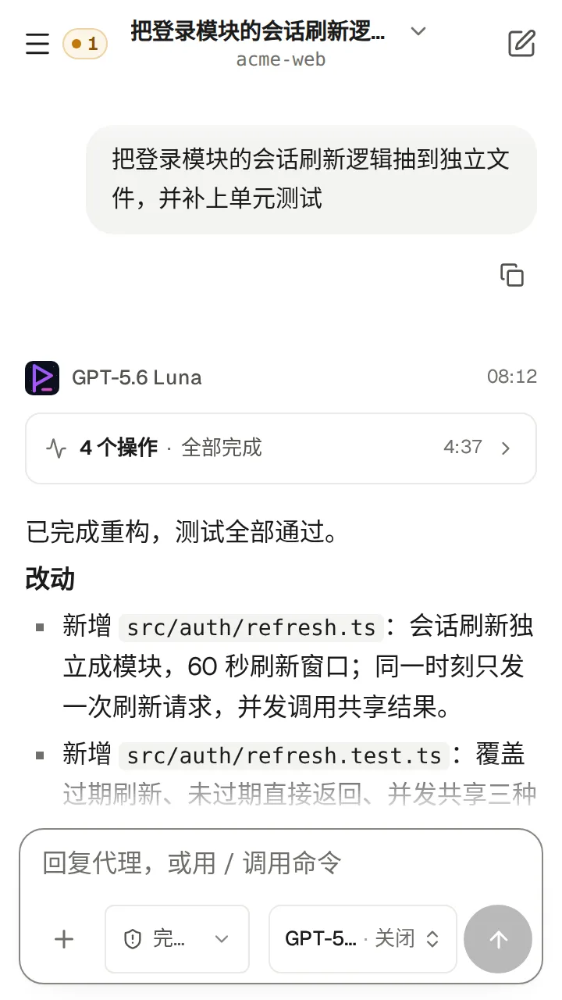
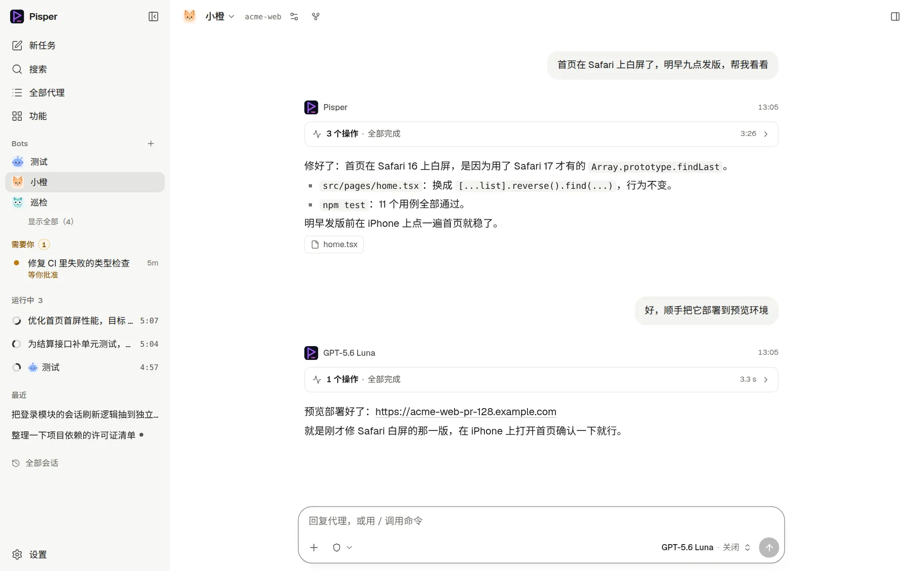
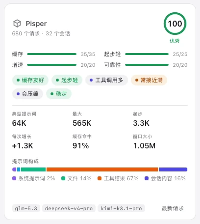

<p align="right"><a href="./README.md">简体中文</a> · <strong>English</strong></p>

<p align="center">
  
</p>

<p align="center">
  A local-first multi-agent app: several agents work in parallel, and desktop, terminal and phone share one core.
</p>

<p align="center">
  <a href="https://github.com/ling-kong-ran/pisper/releases/latest"></a>
  <a href="https://www.npmjs.com/package/pisper"></a>
  <a href="./LICENSE"></a>
  
</p>

<p align="center">
  <a href="docs/shots/desktop-overview.png"></a>
</p>

## What is Pisper

Pisper organizes several AI coding agents into a workbench that runs for the long haul. Each agent has its own session, folder, model and permissions. The sidebar groups them into Needs you, Running and Recent, so you can see at a glance who is waiting for you and allow or deny risky commands in place.

Desktop (Tauri), terminal (Ratatui) and phone (Android / iOS) run the same Node Runtime, and sessions, memory and settings stay on your own devices. The underlying agent runtime is [Pi Coding Agent](https://github.com/earendil-works/pi/tree/main/packages/coding-agent).

[Website](https://pisper.cc) · [Guide](https://pisper.cc/guide.html) · [Changelog](https://pisper.cc/changelog.html)

## Features

- **Parallel agents**: several sessions move forward at once; approvals and questions appear as cards in the conversation. `Ctrl/⌘ + K` jumps across sessions.
- **Session tree**: branch off from any turn, rewind files turn by turn, mark turns; the original conversation is never rewritten.
- **Approvals and permission rules**: Review before writing, Auto-approve or Full access; allow or deny commands in bulk by prefix, with dangerous commands stopped separately.
- **Sub-agents and ways to drive work**: one model for each of the fast / standard / strong tiers; Plan, Goal and Team modes.
- **Browser, computer and remote machines**: agents operate websites in the side browser with your sign-ins; Computer Use operates desktop apps; work runs on another machine over SSH or an executor node.
- **Tools, plugins and MCP**: core tools stay loaded while plugins, MCP servers and skills activate on demand; when a capability is missing the agent writes a plugin; the built-in MCP server lets other local agents use Pisper.
- **Memory, workflows and schedules**: preferences and decisions are remembered and traceable; prompts, files, MCP and notifications wire into workflows; scheduled tasks start on time and report through Feishu, WeChat and other channels.
- **Models and fallbacks**: multiple providers; when the primary model is unavailable or out of quota, Pisper switches to backup models in order and keeps going.

There is also voice input and conversation mode, native components, Git / SVN workspaces and desktop pets. See the [Guide](https://pisper.cc/guide.html).

<p align="center">
  <a href="docs/shots/cli.png"></a>
  
</p>

## Pisper Bot (Labs)

A Bot is a conversation that stays open, plus a profile of who it is and what it looks after. Open it and keep talking; it remembers what came before, edits files and runs commands on its own, and only comes to you for risky actions. Call it from Feishu or WeChat, put it on a schedule, send its work to a remote machine, or put several Bots in a group: @ someone to wake them, and without an @ the room decides who should answer.

Bots are off by default; turn them on in **Settings › Labs**. Turning them off hides Bots and their sessions but keeps the records. See the [Bot guide](https://pisper.cc/guide.html#bots).

<p align="center">
  <a href="docs/shots/desktop-bot.png"></a>
</p>

## Measured numbers

The card below is from the author's own usage, measured by the magpie gateway: 680 requests across 32 sessions, with the models glm-5.3, deepseek-v4-pro and kimi-k3.1-pro. The score and tags are computed over the requests in the selected time range.

<p align="center">
  <a href="docs/shots/prompt-analysis.png"></a>
</p>

| Metric | Value |
| --- | --- |
| Score | 100 (cache 35/35, light start 25/25, growth 20/20, reliability 20/20) |
| Typical / first / largest prompt | 64K / 3.3K / 565K |
| Growth per turn | +1.3K |
| Cache hit rate | 91% |
| Context window | 1.05M |
| Prompt composition | system prompt 2% · files 14% · tool results 67% · conversation 16% |

With the system prompt at 2% and a first request of 3.3K, nearly the whole context is left for your files and tool results. That comes from a few Runtime design choices: hot/cold tool tiers, discover/call on-demand loading, stably ordered tool definitions and prompt-shape diagnostics, all aimed at keeping the provider's prompt cache hitting.

## Install

### Desktop

Download the installer for your platform from [Releases](https://github.com/ling-kong-ran/pisper/releases/latest). It bundles the terminal UI and the Runtime, so Node.js is not required.

| System | Installer | Notes |
| --- | --- | --- |
| Windows x64 | `*-setup.exe` | Recommended. Reuses the system WebView2 and installs it when missing; auto-update uses this package. |
| | `*-offline-setup.exe` | Offline package with the WebView2 installer included, for machines without internet access. |
| macOS | `*.dmg` | Apple Silicon only. |
| Linux x64 | `*.AppImage` / `*.deb` | AppImage needs FUSE; DEB depends on WebKitGTK and other system libraries. |

Conversations need a reachable model service (an internal one works too); local speech models are downloaded on demand and are not in the offline package.

<details>
<summary>macOS says the app can't be opened</summary>

Pisper is not notarized by Apple yet. After confirming the installer came from the official Releases, open **System Settings → Privacy & Security** and choose **Open Anyway**. If that option is missing:

```bash
sudo xattr -rd com.apple.quarantine /Applications/Pisper.app
```

Only run this on an app downloaded from the official Releases and placed in `/Applications`.

</details>

<details>
<summary>Linux AppImage won't start</summary>

```bash
chmod +x Pisper_*_linux_x86_64.AppImage
./Pisper_*_linux_x86_64.AppImage
```

If FUSE is missing, install `libfuse2` or `libfuse2t64`, or use the DEB instead: `sudo apt install ./Pisper_*_linux_x86_64.deb`. If a system library error appears before the app starts, launching from a terminal shows which one is missing.

</details>

### Mobile app

Packages are in [App Releases](https://github.com/ling-kong-ran/pisper/releases?q=app-v). On first launch, the Android / iOS app starts its bundled on-device Runtime: agents, tools and sessions run on the phone itself, not as a remote control for the desktop.

- **Android**: signed arm64 APK, installs directly.
- **iOS**: unsigned IPA; re-sign it with AltStore, Sideloadly or your own developer account.

<details>
<summary>Connect to the desktop</summary>

1. For the first pairing, keep the phone and the computer on the same LAN and turn on **Settings → Remote access** on the desktop.
2. On the phone, open **Settings → Servers → Add server**, pick the discovered desktop and send a request; the desktop issues a device token only after approving it.
3. On different networks, generate a one-time QR code on the desktop and scan it. Connections prefer the LAN and fall back to Iroh P2P; every path verifies the TLS fingerprint and uses the device token.

Capabilities a phone cannot run (shell, MCP, workflows and so on) are hidden automatically.

</details>

### npm

Requires Node.js 20 or later; installation downloads the terminal UI and the Runtime.

```bash
npm i -g pisper
pisper            # terminal UI; run /provider first to configure a model
pisper web        # open the web UI
```

Commands and flags are in the [TUI reference](./src-tui/README.md).

### From source

Requires Node.js 24 and npm.

```bash
git clone https://github.com/ling-kong-ran/pisper.git
cd pisper
npm ci
npm run dev                   # web and API, default http://127.0.0.1:5173
npm run desktop:webview:dev   # desktop shell
```

Data lives in `~/.pisper/agent` by default; set `PISPER_AGENT_DIR` to move it.

## Data safety

Pisper has no "our cloud". Sessions, memory and settings stay on your own devices; only the model services, external MCP servers, search and channels you configure and actually use receive the data their task needs.

- **Local only by default**: the desktop Runtime binds to 127.0.0.1 and the on-device Runtime on a phone listens on a random loopback port; LAN HTTPS and Iroh P2P start only after you turn on remote access, protected by TLS fingerprints and device tokens. Pi telemetry is off by default.
- **Secrets redacted first**: common API keys, Bearer / JWT tokens, private keys and connection strings are replaced before memory is written or summaries are shown; credentials are never echoed to agents through normal interfaces, and the host shell strips common credential environment variables.
- **External MCP is opt-in**: the built-in MCP server is off by default, listens only on 127.0.0.1 and uses its own token.
- **Traceable memory**: every change is logged and can be undone; what you said yourself is never overridden by model inferences.

Redaction only recognizes common formats; it is not full DLP, sandboxing or end-to-end encryption. Provider credentials live in the local data folder (on phones, in the app's private folder, not yet in Keystore / Keychain), so protect that folder and its backups.

## Architecture

- **Runtime**: Node.js, ESM. HTTP / SSE endpoints, domain services, the Pi engine wiring and app-level tools live here; on desktop it ships as a Node SEA inside the app.
- **Interfaces**: a React + TypeScript web UI, Tauri 2 desktop and mobile shells, and a Ratatui terminal UI written in Rust.
- **Independent updates**: Desktop, TUI, Runtime and the mobile app each have their own versions, signatures and updates, and fall back to the bundled version if an update fails.

## Development

```bash
npm run check   # types, lint, i18n, formatting and startup checks
npm test        # every test under runtime/tests
npm run build   # production build (with size budget and Safari compatibility checks)
```

Repository conventions are in [AGENTS.md](./AGENTS.md). [Issues](https://github.com/ling-kong-ran/pisper/issues) and [pull requests](https://github.com/ling-kong-ran/pisper/pulls) are welcome; please don't commit API keys, bot credentials or personal data from `~/.pisper/agent`.

## Docs

- [Guide](https://pisper.cc/guide.html) — from installing and configuring models to Bots, workflows, memory and all three surfaces
- [Changelog](https://pisper.cc/changelog.html) — what changed in each version
- [TUI reference](./src-tui/README.md) — terminal commands and flags
- [Privacy](https://pisper.cc/privacy.html) · [Support](https://pisper.cc/support.html)

## Acknowledgements and license

Thanks to [Pi Coding Agent](https://github.com/earendil-works/pi/tree/main/packages/coding-agent), [Petdex](https://petdex.dev) and the open-source software this project uses. Contributors: [@mik-myp](https://github.com/mik-myp) (frontend architecture, shadcn/ui and i18n refactor, [#1](https://github.com/ling-kong-ran/pisper/pull/1)).

[MIT License](./LICENSE) · © Pisper Contributors
