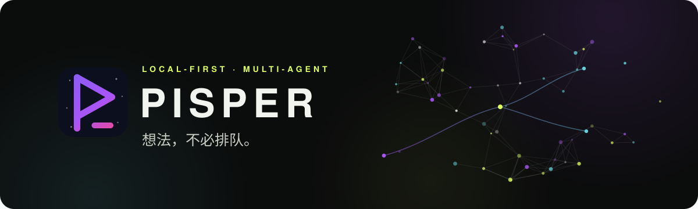
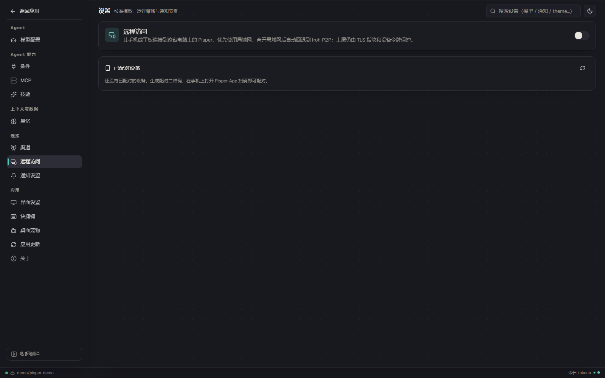
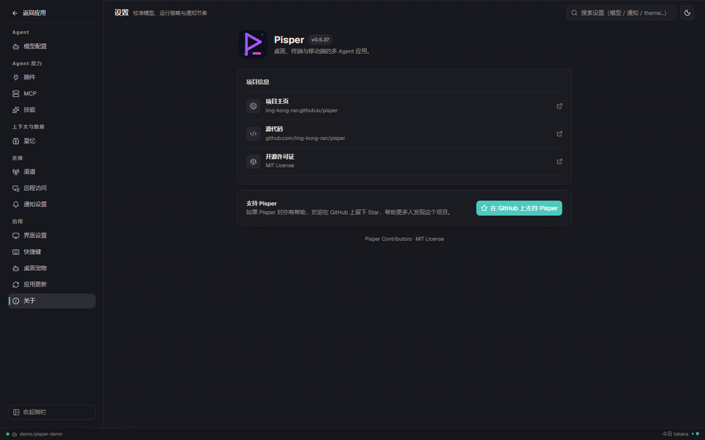

<p align="right"><strong>简体中文</strong> · <a href="./README.en.md">English</a></p>

<a id="top"></a>

<p align="center">
  
</p>

<p align="center">
  跨桌面、终端与手机的多 Agent 应用：像管理代码分支一样管理 Agent 的思路，从任意已完成 Turn 长出分支，并行推进。
</p>

<p align="center">
  <a href="https://github.com/ling-kong-ran/pisper/releases"></a>
  <a href="https://github.com/ling-kong-ran/pisper/stargazers"></a>
  <a href="./LICENSE"></a>
  
  
</p>

<p align="center">
  <a href="https://github.com/ling-kong-ran/pisper/releases/latest">
    
  </a>
</p>

<p align="center">
  <a href="https://ling-kong-ran.github.io/pisper/#mobile">移动端下载</a> ·
  <a href="https://github.com/ling-kong-ran/pisper/releases?q=app-v">App Releases</a>
</p>

<p align="center">
  <a href="https://ling-kong-ran.github.io/pisper/">项目主页</a> ·
  <a href="#quickstart">三分钟上手</a> ·
  <a href="#features">能力地图</a> ·
  <a href="#data-safety">数据安全</a> ·
  <a href="./README.en.md">English</a>
</p>

<p align="center">
  
</p>

<a id="why"></a>

## ✨ 为什么是 Pisper

- **对话也能开分支。** 在任意已完成 Turn 衍生新会话，继承上下文，源会话一字不改；稳定 Turn 标签把关键节点钉成可检索的锚点 —— 像 Git，但给 Agent 用。
- **多 Agent 真并行。** 每个会话独享模型、上下文、工作目录与权限；拖动标签四面分屏，进度同屏可见。
- **工具冷热分明。** 核心工具常驻上下文；插件、MCP 与技能经 discover/call 网关按需激活、用完即退 —— 能力再丰富，也不把上下文塞成杂物间。
- **前缀稳，缓存才热。** 工具定义稳定化排序、提示词形态哈希诊断，尽量吃满 Provider 的 prompt cache —— 长会话更快、更省。
- **缺什么能力，直接说。** Pisper 会自己编写、校验并安装本地插件，下一轮对话就能调用。
- **手机能独立，也能接桌面。** Android / iOS App 可在手机上运行受限本机 Runtime，使用 OpenAI 兼容 Provider 流式对话并保存本地会话；也可扫码连接桌面，优先 LAN、离开局域网后自动回退 Iroh P2P。Android Keystore / iOS Keychain 保护本机 Provider 密钥，远程模式继续使用 TLS 指纹与设备 Bearer 令牌。
- **数据默认不出机。** Runtime 默认只听 127.0.0.1，敏感格式自动脱敏，记忆先审后用 —— 你的上下文，你说了算。

<a id="features"></a>

## 🗺️ 能力地图

| 🌿 并行与分叉 | 🧩 能力扩展 |
| --- | --- |
| 并行会话分屏 · 追忆分支树 · 稳定 Turn 标签 · Ctrl+K 跨会话直达 · 会话级模型/目录/权限 | 本地插件自动生成 · MCP 服务 · 技能中心 · 多 Provider 模型配置 |
| **⚡ 自动化与通知** | **🖥️ 终端与桌面一体** |
| 可视化工作流 · 定时任务 · 飞书 / 个人微信双向渠道 · 星忆项目记忆 · Git 与 SVN 工作区 | Ratatui TUI 与桌面共用 Runtime · Android / iOS 本机轻量 Runtime 或桌面连接 · 桌面宠物（Petdex）· Desktop / TUI / Runtime / App 独立更新 |

<a id="pi-runtime"></a>

## 🧠 基于 Pi Coding Agent 深度构建

Pisper 以 [Pi Coding Agent](https://github.com/earendil-works/pi/tree/main/packages/coding-agent) 作为底层 Agent Runtime。在 Pi 提供的模型接入与工具执行基础上，Pisper 围绕真实的多 Agent 工作持续做深度产品化与优化：

- **运行时与会话编排**：把独立会话、并行执行、Turn 分支、工作目录与权限策略组织成可持续运行的多 Agent 系统。
- **上下文与性能**：通过工具冷热分层、discover/call 按需加载、稳定工具定义与提示词形态诊断，减少上下文占用并提高 Provider prompt cache 命中率。
- **完整产品层**：提供 Desktop、Ratatui TUI 与移动端体验；手机本机模式提供资源受限的流式对话，连接桌面 Runtime 后可继续使用工作流、定时任务、记忆、MCP、技能、插件和双向渠道。

## 📸 界面预览

<table>
  <tr>
    <td><a href="docs/shots/chat-grid.png"></a></td>
    <td><a href="docs/shots/session-tree.png"></a></td>
  </tr>
  <tr>
    <td align="center">并行会话：拖标签，四面分屏</td>
    <td align="center">追忆：在任意已完成 Turn 接回原分支</td>
  </tr>
  <tr>
    <td><a href="docs/shots/workflow-builder.png"></a></td>
    <td><a href="docs/shots/cli-chat.png"></a></td>
  </tr>
  <tr>
    <td align="center">工作流：把重复工作连成流程</td>
    <td align="center">TUI：离开桌面，上下文不走</td>
  </tr>
  <tr>
    <td><a href="docs/shots/config-remote-access.png"></a></td>
    <td><a href="docs/shots/config-about.png"></a></td>
  </tr>
  <tr>
    <td align="center">设备连接：LAN 优先、P2P 回退与设备管理</td>
    <td align="center">关于：版本、项目链接与开源许可证</td>
  </tr>
</table>

<a id="quickstart"></a>

## 🚀 三分钟上手

### 方式一：桌面版（推荐）

从 [Releases](https://github.com/ling-kong-ran/pisper/releases/latest) 下载对应平台安装包，**自带 TUI 与 Runtime，无需安装 Node.js**。

<details>
<summary>macOS 提示「无法打开」？</summary>

Pisper 当前尚未经过 Apple 公证。请确认安装包来自官方 Releases，并在 **系统设置 → 隐私与安全性** 中选择 **仍要打开**。若没有该选项：

```bash
sudo xattr -rd com.apple.quarantine /Applications/Pisper.app
```

请仅对从官方 Releases 下载并放入 `/Applications` 的应用使用此命令。

</details>

<details>
<summary>Linux AppImage 无法启动？</summary>

```bash
chmod +x Pisper_*_linux_x86_64.AppImage
./Pisper_*_linux_x86_64.AppImage
```

缺少 FUSE 时安装 `libfuse2` 或 `libfuse2t64`，也可改用 `.deb`：

```bash
sudo apt install ./Pisper-*-linux-amd64.deb
```

</details>

### 方式二：移动端 App

Android / iOS App 首屏把 **本机运行** 与 **连接桌面端** 作为平等选项，不要求先扫码，也不会把本机模式藏在多层设置里。项目主页会从 `docs/latest-app.json` 解析最新 App 下载地址，但页面不显示或写死具体版本号：

| 平台 | 下载 | 安装状态 |
| --- | --- | --- |
| Android | [下载已签名 APK](https://ling-kong-ran.github.io/pisper/#mobile) | 已签名通用 APK，可直接安装；首次侧载时按系统提示允许安装未知来源应用。 |
| iOS | [下载未签名 IPA](https://ling-kong-ran.github.io/pisper/#mobile) | **未签名**，不能直接安装；需使用 AltStore、Sideloadly 或自己的 Apple 开发者账号重签。 |

**本机运行**

1. 在首屏选择「本机运行」，或从底部导航进入 **设置 → 服务器 → 进入本机模式**。
2. 添加 OpenAI 兼容 Provider，填写 Base URL、API Key 与模型；连接测试会返回可选模型。
3. 会话与 Provider 配置只保存在手机。Provider 密钥由 Android Keystore 或 iOS Keychain 保护，本机 Runtime 仅监听手机回环地址，并限制会话数、消息数与落盘大小。

**连接桌面端**

1. 建议首次配对时让手机与电脑接入同一局域网，在桌面端打开 **设置 → 远程访问**。
2. 开启远程访问并等待 P2P relay 就绪，再生成配对二维码；配对码 5 分钟过期且只能使用一次。
3. 在手机 App 选择「连接桌面端」并扫码。配对后优先 LAN，失败时回退 Iroh P2P；两条路径都继续校验 TLS 指纹、注入设备 Bearer 令牌并支持 SSE 恢复。

手机会记住上次使用的本机/远程模式。完整流程、资源边界、安全模型与排障见 **[移动端使用指南](./docs/mobile.md)** 和 **[本机 Runtime 设计](./docs/mobile-local-runtime.md)**。

### 方式三：npm（Node.js 20+）

```bash
npm i -g pisper
pisper web   # 打开 Web 前端与本机配置页
```

首次进入使用 `/provider` 选择 Provider 并配置 API Key。可用命令及参数见 **[TUI 命令参考](./src-tui/README.md)**。

### 方式四：从源码运行

<details>
<summary>展开</summary>

需要 Node.js 20+、npm，以及至少一个模型 Provider 与 API Key。

```bash
git clone https://github.com/ling-kong-ran/pisper.git
cd pisper
npm install
npm run dev
```

桌面开发与打包：

```bash
npm run desktop:webview:dev
npm run desktop:webview:build
```

</details>

数据默认保存在 `~/.pisper/agent`，可通过 `PISPER_AGENT_DIR` 修改。

<a id="data-safety"></a>

## 🔒 数据安全

Pisper 没有「我们的云」。日常数据默认由本机 Runtime 持有，只有你配置并实际调用的 Provider、MCP、搜索或渠道，才会收到完成请求所需的内容。

- **默认只听本机**：桌面 Runtime 常规入口绑定 127.0.0.1；手机本机 Runtime 只监听随机回环端口。只有显式开启桌面远程访问后，才会额外启动 LAN HTTPS 与 Iroh P2P endpoint。Iroh 只承载原始加密字节，上层仍由 TLS 指纹和设备 Bearer 令牌保护。Pi 遥测默认关闭。
- **敏感先脱敏、密钥分平台保护**：常见 API Key、Bearer/JWT、私钥与连接串，在记忆落盘与摘要展示前被替换。手机本机 Provider 密钥使用 Android Keystore 或 iOS Keychain 加密，持久化文件不写明文 API Key。
- **权限有边界**：只读、完全访问、单次审批三档；凭据不经普通接口回显给 Agent，宿主 Shell 会移除常见凭据环境变量。
- **记忆需确认**：自动推断的记忆先进入待确认区，你点头之前不参与召回。

> 边界说明：脱敏只识别常见敏感格式，不是完整 DLP、沙箱或端到端加密。桌面 Runtime 的 Provider 凭据仍位于本机 Agent 数据目录，请保护该目录和备份；手机安全存储也不能替代设备锁屏、系统更新与可信侧载来源。完整说明见[项目主页数据安全部分](https://ling-kong-ran.github.io/pisper/#safety)。

## 🧩 组件与独立更新

Desktop、TUI、Runtime 与移动 App 各自独立版本、独立签名、独立更新，失败自动回退到内置版本。桌面端提供统一组件检查入口；移动 App 使用独立发布清单。

## 📚 文档

- [项目主页](https://ling-kong-ran.github.io/pisper/) · 产品介绍与界面演示
- [TUI 命令参考](./src-tui/README.md) · CLI、Slash command 与参数说明
- [移动端使用指南](./docs/mobile.md) · Android / iOS 安装、本机运行、桌面配对、安全模型与排障
- [移动端本机 Runtime](./docs/mobile-local-runtime.md) · 资源边界、Provider、密钥存储与模式切换
- [本地插件指南](./docs/local-plugins.md) · [插件开发指南](./docs/plugin-authoring.md)
- [桌面宠物（Petdex）](./docs/petdex-integration.md)

<a id="development"></a>

## 🛠️ 开发

底层 Agent Runtime 基于 [Pi Coding Agent](https://github.com/earendil-works/pi/tree/main/packages/coding-agent) 深度集成；产品层主要使用 React、TypeScript、Tauri、Rust 与 Node SEA。

```bash
npm run check   # typecheck + lint + i18n + format
npm test        # runtime 测试
npm run build   # 生产构建
```

欢迎提交 [Issue](https://github.com/ling-kong-ran/pisper/issues) 与 [Pull Request](https://github.com/ling-kong-ran/pisper/pulls)。请勿提交 API Key、机器人凭据，或 `~/.pisper/agent` 中的个人数据。

## 🙏 致谢

感谢 [Pi Coding Agent](https://github.com/earendil-works/pi/tree/main/packages/coding-agent)、[Petdex](https://petdex.dev) 及本项目使用的开源软件。

贡献者：

- [@mik-myp](https://github.com/mik-myp) — 前端 TypeScript 架构、shadcn/ui / AI Elements、Zustand 与 i18n 重构（[#1](https://github.com/ling-kong-ran/pisper/pull/1)）

<a id="sponsors"></a>

## ❤️ 赞助

<details>
<summary>查看赞助商</summary>

<table>
<tr>
<td width="180" align="center">
  <a href="https://matrix.000328.xyz/sign-up?aff=ZPeH"><strong>Matrix</strong></a>
</td>
<td>
感谢 <a href="https://matrix.000328.xyz/sign-up?aff=ZPeH">Matrix</a> 对 Pisper 社区的支持。通过<a href="https://matrix.000328.xyz/sign-up?aff=ZPeH">此链接</a>注册，可能为 Pisper 项目带来推广收益。
</td>
</tr>
</table>

> 赞助链接包含推广参数。Pisper 的赞助内容不会使用会话、工作区、Provider、模型或 API 配置进行定向，也不会向赞助商发送这些数据。客户端赞助位的公开配置维护在 [`docs/sponsors.json`](./docs/sponsors.json)。

</details>

如果你也希望出现在这里，欢迎通过 [Issue](https://github.com/ling-kong-ran/pisper/issues) 联系我们。

---

<p align="center">
  <strong>如果 Pisper 对你有用，点一颗 ⭐ —— 这是让项目继续生长的最大动力。</strong><br />
  <sub>也欢迎分享给每一个把 Coding Agent 当生产力工具的人。</sub>
</p>

<p align="center">
  <a href="./LICENSE">MIT License</a> · © Pisper Contributors ·
  <a href="#top">返回顶部 ↑</a>
</p>
