<p align="right"><strong>简体中文</strong> · <a href="./README.en.md">English</a></p>

<a id="top"></a>

<p align="center">
  
</p>

<h1 align="center">Pisper</h1>

<p align="center"><strong>Pi 驱动的多 Agent 工作台</strong></p>

<p align="center">
  
  
  
  
  <a href="./LICENSE"></a>
</p>

<p align="center">
  <a href="https://github.com/ling-kong-ran/pisper/releases/latest">
    
  </a>
</p>

<a id="sponsors"></a>

## ❤️ 赞助

感谢以下合作伙伴对 Pisper 社区的支持。如果你也希望出现在这里，欢迎通过 [Issue](https://github.com/ling-kong-ran/pisper/issues) 联系我们。

<details open>
<summary>查看赞助商</summary>

<table>
<tr>
<td width="180" align="center">
  <a href="https://matrix.000328.xyz/sign-up?aff=ZPeH"><strong>Matrix</strong></a>
</td>
<td>
感谢 <a href="https://matrix.000328.xyz/sign-up?aff=ZPeH">Matrix</a> 对 Pisper 社区的支持。通过<a href="https://matrix.000328.xyz/sign-up?aff=ZPeH">此链接</a>注册，可能为 Pisper 项目带来推广收益。
</td>
</tr>
</table>

> 赞助链接包含推广参数。Pisper 的赞助内容不会使用会话、工作区、Provider、模型或 API 配置进行定向，也不会向赞助商发送这些数据。客户端赞助位的公开配置维护在 [`docs/sponsors.json`](./docs/sponsors.json)。

</details>

<p align="center">
  <a href="#overview">简介</a> ·
  <a href="#preview">界面</a> ·
  <a href="#features">功能</a> ·
  <a href="#desktop-pet">桌面宠物</a> ·
  <a href="#install">安装</a> ·
  <a href="#tui">终端客户端</a> ·
  <a href="#development">开发</a> ·
  <a href="#sponsors">赞助</a> ·
  <a href="#license">许可</a>
</p>

---

<a id="overview"></a>

## 简介

Pisper 是基于 [Pi Coding Agent](https://github.com/earendil-works/pi/tree/main/packages/coding-agent) 的桌面与终端客户端，支持多会话、工具、Skills、MCP、自动化和会话级权限。

### 三步上手

1. [下载桌面版](https://github.com/ling-kong-ran/pisper/releases/latest)（Windows / macOS / Linux）
2. 配置任意一个模型 Provider 与 API Key
3. 新建会话，开始并行工作

<a id="preview"></a>

## 界面

<p align="center">
  
  <br /><sub><strong>暗色工作台</strong> · 每个会话拥有独立模型、上下文、目录与权限</sub>
</p>

<p align="center">
  <a href="./src-tui/README.md"></a>
  <br /><sub><strong>终端客户端</strong></sub>
</p>

<table>
  <tr>
    <td width="50%" align="center">
      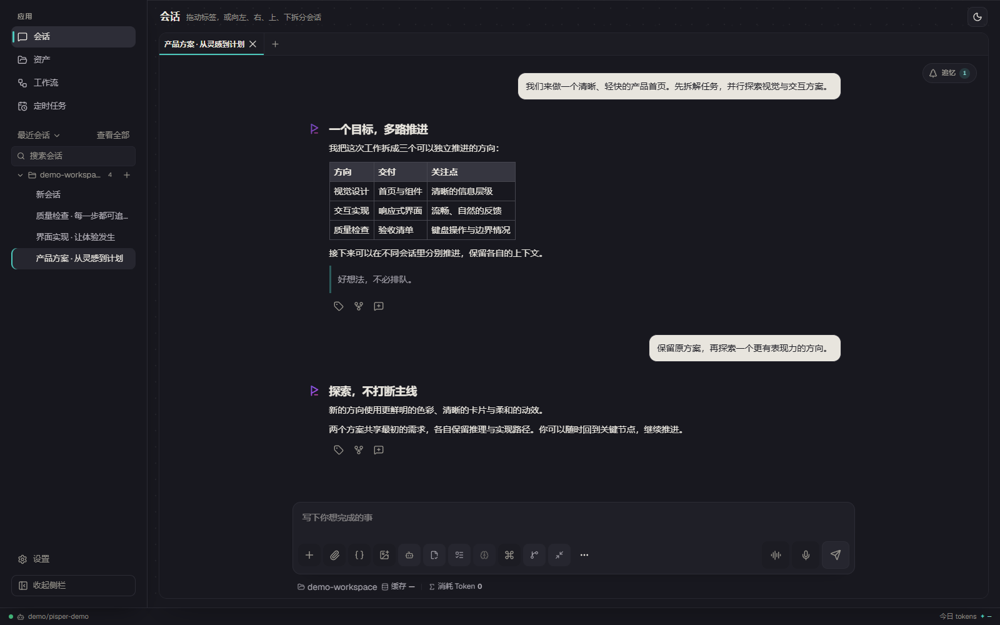
      <br /><sub><strong>会话工作区</strong> · 聚焦任务、工具状态与上下文用量</sub>
    </td>
    <td width="50%" align="center">
      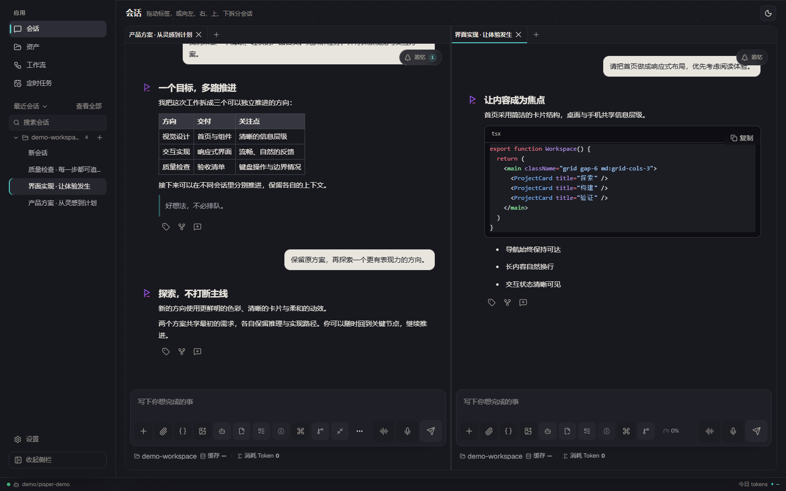
      <br /><sub><strong>Dock 分屏</strong> · 标签、横纵分屏与拖拽停靠</sub>
    </td>
  </tr>
</table>

### 工作台

<table>
  <tr>
    <td width="50%" align="center">
      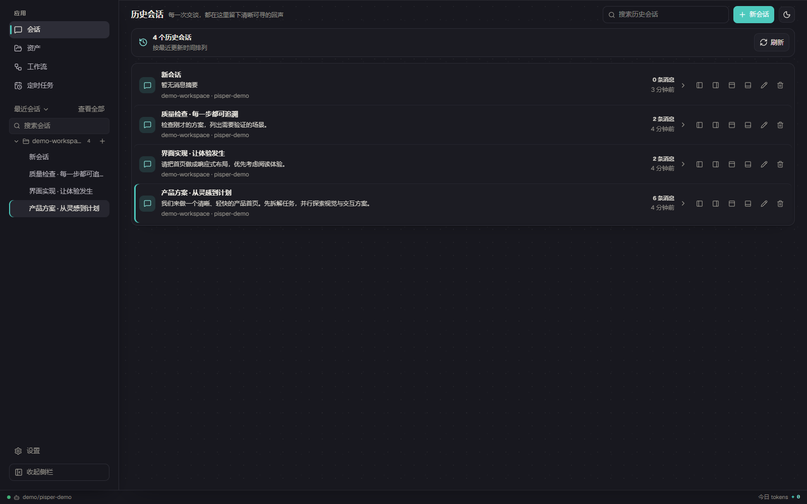
      <br /><sub><strong>历史会话</strong> · 搜索、重命名与恢复任意布局</sub>
    </td>
    <td width="50%" align="center">
      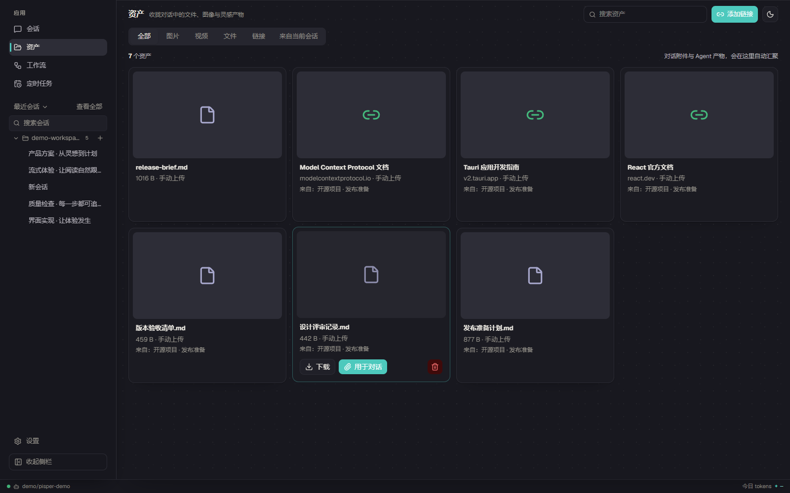
      <br /><sub><strong>资产</strong> · 汇总图片、文件、链接与 Agent 产物</sub>
    </td>
  </tr>
  <tr>
    <td width="50%" align="center">
      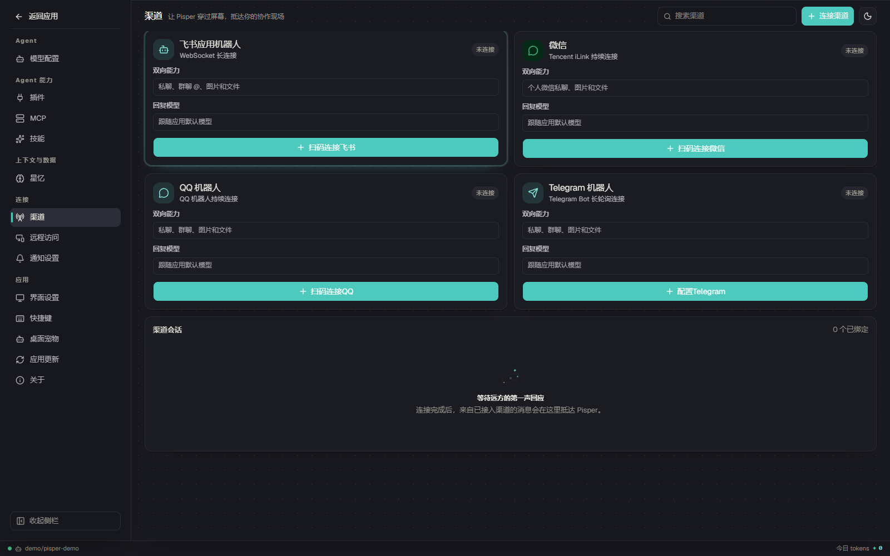
      <br /><sub><strong>双向渠道</strong> · 扫码连接飞书与个人微信、随时随地操作</sub>
    </td>
    <td width="50%" align="center">
      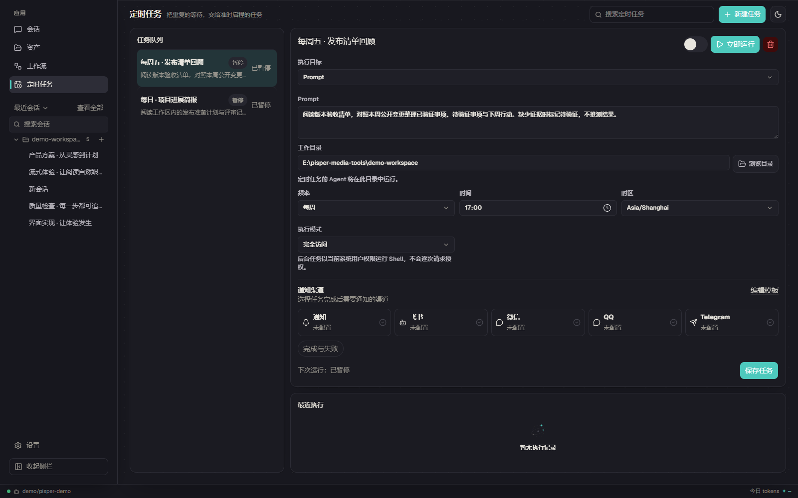
      <br /><sub><strong>定时任务</strong> · 配置频率、执行模式与通知</sub>
    </td>
  </tr>
</table>

### 能力

<table>
  <tr>
    <td width="50%" align="center">
      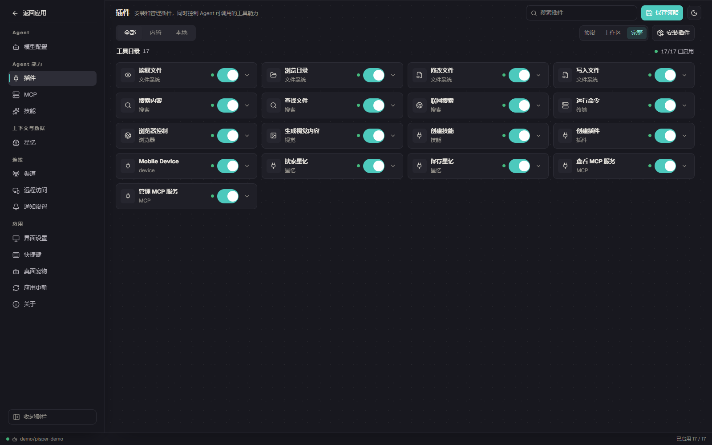
      <br /><sub><strong>工具</strong> · 按风险与执行模式管理权限</sub>
    </td>
    <td width="50%" align="center">
      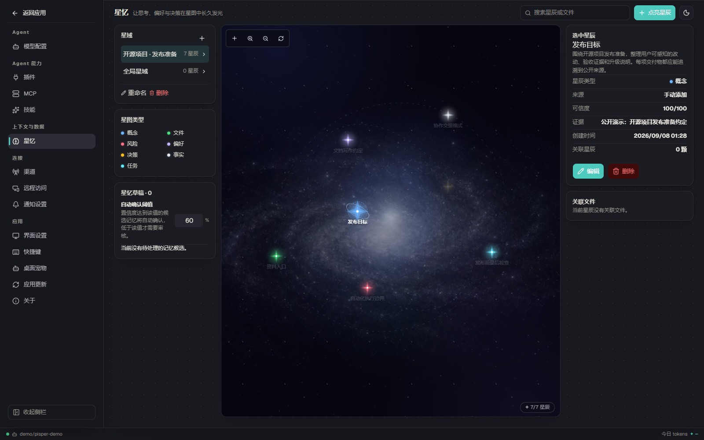
      <br /><sub><strong>星忆</strong> · 在持久记忆星图中检索事实与决策</sub>
    </td>
  </tr>
  <tr>
    <td width="50%" align="center">
      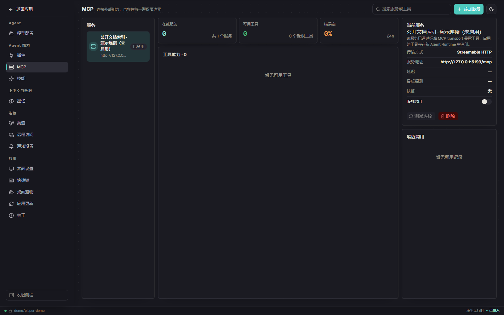
      <br /><sub><strong>MCP</strong> · 管理服务、工具权限与调用记录</sub>
    </td>
    <td width="50%" align="center">
      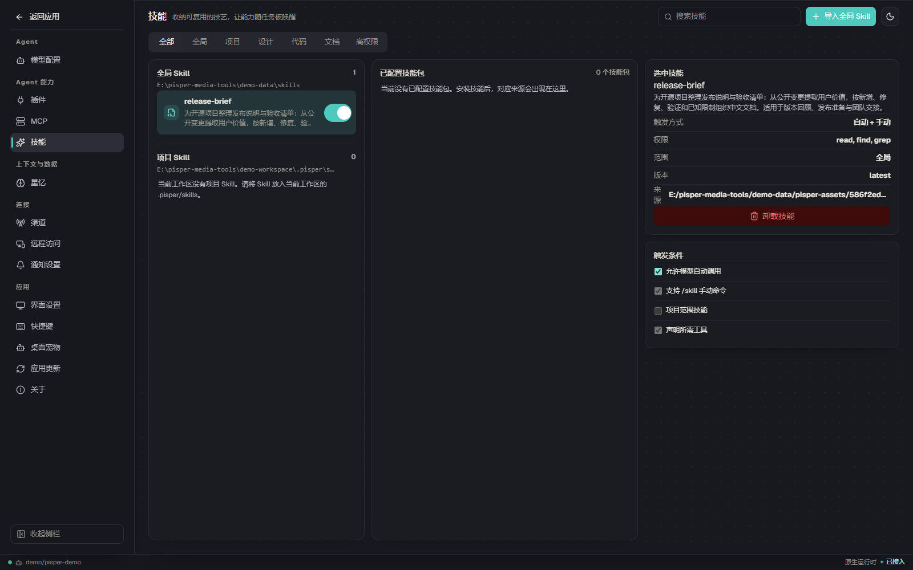
      <br /><sub><strong>技能</strong> · 安装并控制可复用能力包</sub>
    </td>
  </tr>
</table>

### 自动化

<table>
  <tr>
    <td width="50%" align="center">
      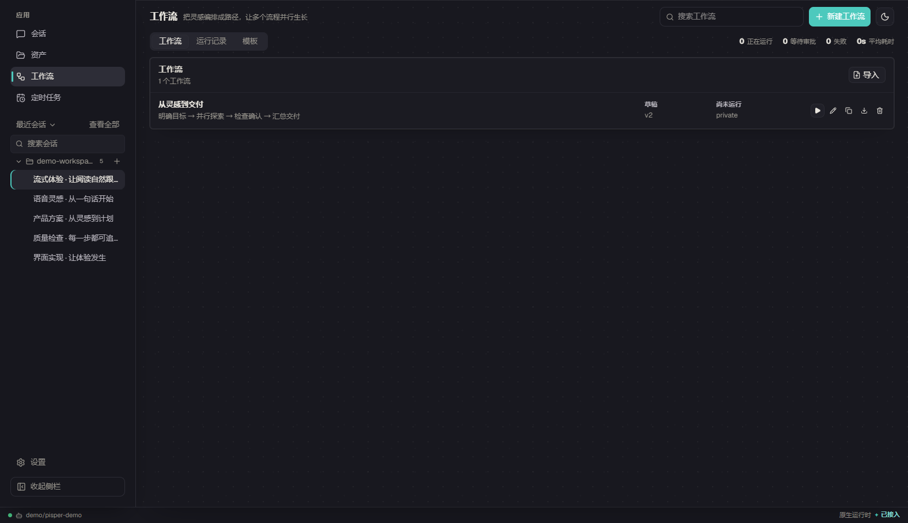
      <br /><sub><strong>工作流</strong> · 从预设或草稿组织自动化</sub>
    </td>
    <td width="50%" align="center">
      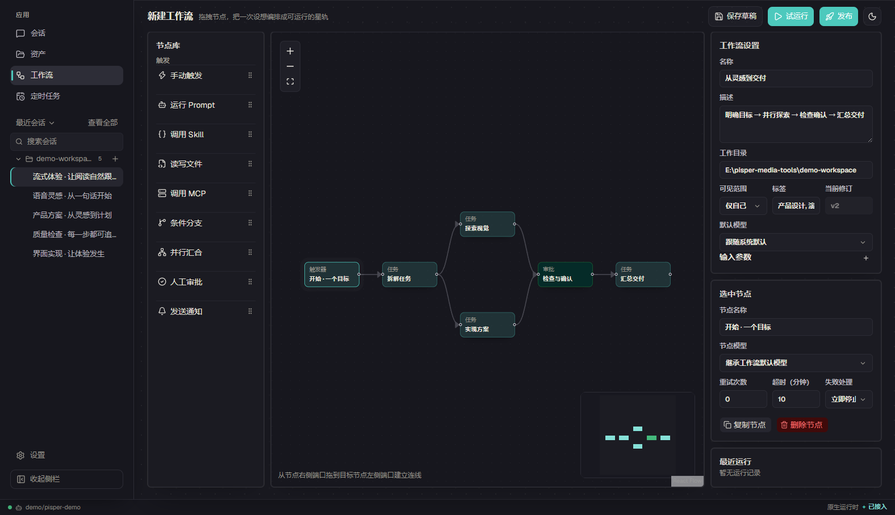
      <br /><sub><strong>可视化编排</strong> · 连接 Prompt、文件、MCP 与通知节点</sub>
    </td>
  </tr>
</table>

### 设置

<p align="center">
  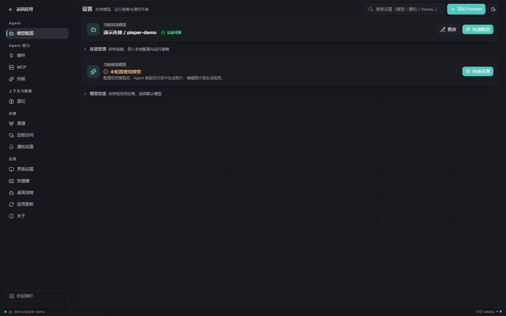
  <br /><sub><strong>Provider 与模型</strong> · 独立管理协议、地址、凭据与模型目录</sub>
</p>

<table>
  <tr>
    <td width="50%" align="center">
      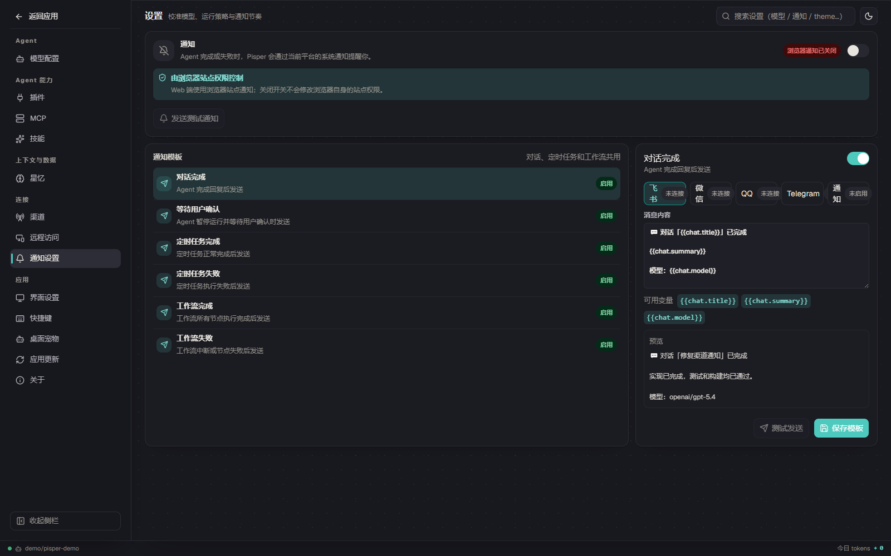
      <br /><sub><strong>通知</strong> · 为会话、任务和工作流定制模板</sub>
    </td>
    <td width="50%" align="center">
      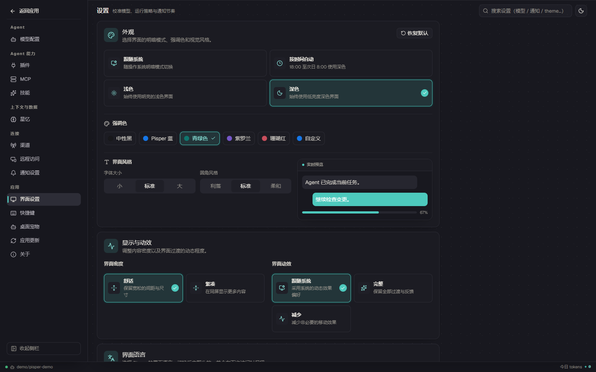
      <br /><sub><strong>界面</strong> · 语言、密度与显示偏好</sub>
    </td>
  </tr>
  <tr>
    <td width="50%" align="center">
      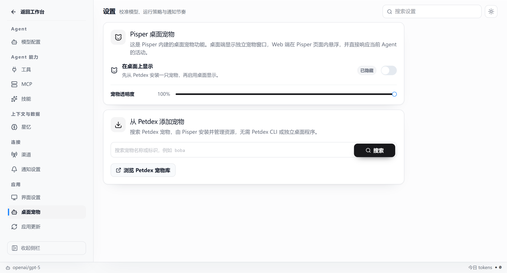
      <br /><sub><strong>桌面宠物</strong> · 从 Petdex 搜索、安装与管理宠物</sub>
    </td>
    <td width="50%" align="center">
      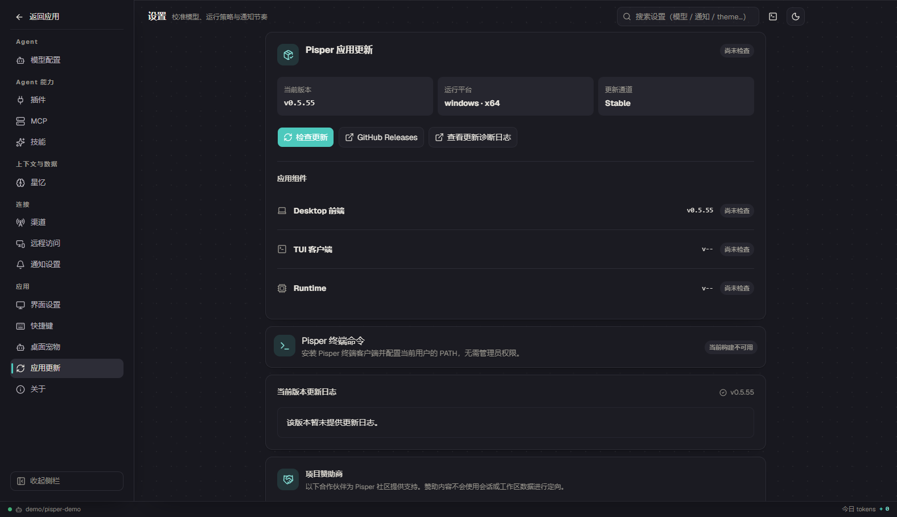
      <br /><sub><strong>应用更新</strong> · 查看版本状态与更新渠道</sub>
    </td>
  </tr>
</table>

<a id="features"></a>

## 功能

- **多会话**：独立模型、上下文、工作目录和权限，支持 Dock 分屏与布局恢复。
- **Tools、Skills 与 MCP**：统一管理能力和调用权限。
- **Subagent**：在隔离上下文中执行临时任务，完成后将结果返回父会话。
- **记忆与多模态**：检索项目记忆，处理图片、文档和代码。
- **自动化与渠道**：定时任务、可视化工作流、飞书和个人微信。
- **桌面与终端**：提供 Tauri 桌面端和 Ratatui TUI。
- **权限控制**：支持 `只读 / 工作区 / 完全访问`、单次审批和凭据隔离。

<a id="desktop-pet"></a>

## 桌面宠物

Pisper 支持 [Petdex](https://petdex.dev) 兼容宠物，可在 **设置 → 桌面宠物** 中安装和管理。详见 [`docs/petdex-integration.md`](./docs/petdex-integration.md)。

<a id="install"></a>

## 安装

### 桌面版（推荐）

前往 [GitHub Releases](https://github.com/ling-kong-ran/pisper/releases/latest) 下载 Windows、macOS 或 Linux 安装包，开箱即用，无需额外安装 Node.js。

#### macOS 无法打开

Pisper 当前尚未经过 Apple 公证。请确认应用来自官方 Releases，并优先在 **系统设置 → 隐私与安全性** 中选择 **仍要打开**。若没有该选项，可执行：

```bash
sudo xattr -rd com.apple.quarantine /Applications/Pisper.app
```

请仅对从官方 Releases 下载并放入 `/Applications` 的应用使用此命令。

#### Linux AppImage 无法启动

```bash
chmod +x Pisper_*_linux_x86_64.AppImage
./Pisper_*_linux_x86_64.AppImage
```

缺少 FUSE 时安装 `libfuse2` 或 `libfuse2t64`，也可改用 `.deb`：

```bash
sudo apt install ./Pisper-*-linux-amd64.deb
```

<a id="tui"></a>

### 终端客户端（TUI）

安装桌面版后，在 **设置 → 终端** 中安装 `pisper` 命令。首次安装由你主动确认；之后桌面应用更新并重启时，Pisper 会自动刷新这份已托管的终端客户端：

```bash
pisper          # 新建会话
pisper resume   # 恢复当前目录最近的会话
pisper doctor   # 诊断运行环境
```

安装、命令、快捷键、附件、执行模式和审批说明见 **[Pisper TUI 使用指南](./src-tui/README.md)**。

### 从源码运行

需要 Node.js 20+、npm，以及至少一个模型 Provider 与 API Key。

```bash
git clone https://github.com/ling-kong-ran/pisper.git
cd pisper
npm install
npm run dev
```

桌面开发与打包：

```bash
npm run desktop:webview:dev
npm run desktop:webview:build
```

数据默认保存在 `~/.pisper/agent`，可通过 `PISPER_AGENT_DIR` 修改。

<a id="development"></a>

## 开发

主要技术栈：React、TypeScript、Tauri、Rust、Node SEA 与 Pi Coding Agent。

```bash
npm run check
npm test
npm run build
```

欢迎提交 [Issue](https://github.com/ling-kong-ran/pisper/issues) 与 [Pull Request](https://github.com/ling-kong-ran/pisper/pulls)。请勿提交 API Key、机器人凭据，或 `~/.pisper/agent` 中的个人数据。

<a id="license"></a>

## 许可

Pisper 采用 [MIT License](./LICENSE)。第三方依赖和社区资源遵循各自许可证。

## 致谢

感谢 [Pi Coding Agent](https://github.com/earendil-works/pi/tree/main/packages/coding-agent)、[Petdex](https://petdex.dev) 及本项目使用的开源软件。

贡献者：

- [@mik-myp](https://github.com/mik-myp) — 前端 TypeScript 架构、shadcn/ui / AI Elements、Zustand 与 i18n 重构（[#1](https://github.com/ling-kong-ran/pisper/pull/1)）

<p align="right"><a href="#top">返回顶部 ↑</a></p>
