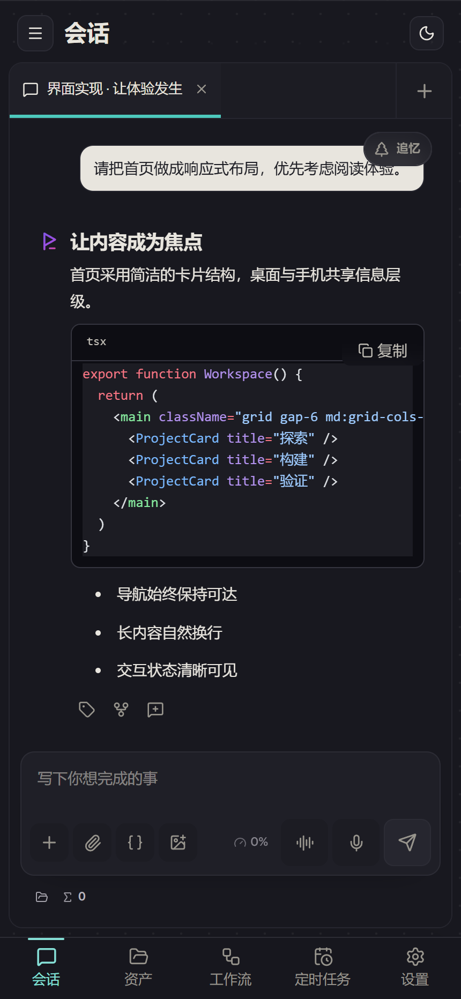

# Pisper 移动端使用指南

Pisper 移动端有两种使用方式：不依赖电脑、直接在手机运行 Node/Pisper Runtime 的本机模式，
以及连接 Desktop Runtime 的远程模式。两种模式使用相同的 React、Provider、会话、标准 `/api/*`
和 HTTP/SSE 契约，也都不把数据同步到 Pisper 云服务。

本机模式把会话、Provider 配置和工作区保存在手机 App 私有目录。Android/iOS 统一由签名包内的
embedded Node 24 承载，并按实际 Node 模块清单关闭宿主不支持的系统能力。公开 APK、AAB 与 IPA
都不包含 rootfs、`su`、`chroot` 或运行时下载的替代载体。详见
[移动端本机 Runtime 设计](./mobile-local-runtime.md)。

远程模式下，Android / iOS App 优先通过局域网直连桌面；局域网不可达时，可通过内置 Iroh P2P
隧道建立连接。Pisper 不运营账号或自有中转服务，Iroh relay 仅承载仍受 TLS 保护的隧道字节。



## 下载与安装

| 平台 | 资产 | 安装说明 |
| --- | --- | --- |
| Android | [从项目主页下载已签名 APK](https://ling-kong-ran.github.io/pisper/#mobile) | 官方 Release 提供已签名 arm64 APK，适用于 64 位 ARM Android 设备。首次侧载时，Android 可能要求允许当前浏览器或文件管理器安装未知来源应用。 |
| iOS | [从项目主页下载未签名 IPA](https://ling-kong-ran.github.io/pisper/#mobile) | 未签名构建，不含可直接用于真机安装的 provisioning profile。必须使用 AltStore、Sideloadly 或自己的 Apple 开发者账号重签后安装。 |

Release 同时提供资产的 Minisign 签名文件。iOS IPA 的“未签名”描述的是 Apple 代码签名与
设备安装状态，不表示它是 Android 那样可直接安装的正式签名包。

后续版本请从[项目首页](https://ling-kong-ran.github.io/pisper/#mobile)或
[App Releases](https://github.com/ling-kong-ran/pisper/releases?q=app-v)进入。项目首页的版本和下载地址由
`docs/latest-app.json` 更新，不依赖页面内写死的版本号。

## App 更新

更新渠道由安装来源决定，商店包和 GitHub 侧载包不会混用更新机制：

- Google Play 与 App Store 构建只通过对应商店更新，不检查、下载或打开 GitHub 安装包。
- GitHub Android 侧载版会检查独立的 `app-v*` 发布清单，并在 **设置 -> 应用更新** 打开已签名 APK；安装仍由 Android 系统确认，不会绕过未知来源授权。
- GitHub iOS 版会打开未签名 IPA；受 Apple 签名机制限制，仍需重签后安装，不能在 App 内静默替换。
- GitHub 更新清单仅接受 Pisper Release 的 HTTPS 地址、匹配的 `app-v<version>` 标签和安全资产名；Android 还会校验 APK 应用签名。

## 本机运行

首次启动会直接进入本机 Runtime，无需先配对电脑；之后可以从 **设置 -> 服务器** 在本机与已配对的
Desktop 之间切换。App 只记忆 `local` 或 `remote`，不会显示 root/embedded 等内部载体。

本机 Runtime 只监听随机 `127.0.0.1` 端口。它完成 Agent Runtime 初始化后才向壳层写入带随机
bootstrap token 的 READY 文件，然后打开正常 Pisper React 界面。Provider、模型发现、会话、
流式回复、工作区读写、Skill、内置工具和 Web Search 继续使用标准 Runtime 实现。

Android/iOS embedded Node 没有 `child_process` 等宿主能力时，终端、VCS、MCP stdio、工作流、
计划任务、多 Agent 和第三方插件执行会按 `/api/runtime/capabilities` 从导航与 API 中同时关闭；
内置工具目录与 Web Search 设置不会因 plugin worker 缺失而消失。

当前 Provider 凭据保存在 App 私有数据目录，依赖系统沙箱和文件权限保护，尚未接入 Android
Keystore / iOS Keychain。不要导出或分享 App 私有数据。

[语音输入 对话模式](https://ling-kong-ran.github.io/pisper/guide.html#voice)

## 三步配对

开始前，请把桌面 Pisper 与移动 App 更新到兼容版本。建议首次配对时让手机与电脑连接同一个可信局域网；电脑需要在使用手机期间保持开机并运行 Pisper。

1. 在桌面端打开 **设置 -> 远程访问** 并开启远程访问。默认远程端口是 `5174`；局域网地址、证书指纹和 P2P endpoint 都包含在配对二维码中。桌面会检查防火墙，并在需要时请求系统管理员授权配置 Pisper 的放行规则；取消授权时仍可使用可用的 P2P 路径，设置页会保留真实状态和重试入口。
2. 同一局域网内，在手机 **设置 -> 服务器 -> 添加服务器** 中允许本地网络访问，选择自动发现的桌面并点击“申请连接”。桌面审批卡会显示设备名和来源 IP；桌面用户明确批准后，手机才领取一次性设备令牌并进入远程界面。
3. 异地连接、Bonjour/mDNS 不可用或需要转发二维码图片时，在桌面生成配对二维码，再由手机扫描。配对码 5 分钟后过期、只能使用一次；每次重新生成都会使上一个配对码失效。

## 连接方式

桌面端保留原有的本机回环 HTTP 入口，并在用户开启远程访问后额外启动 LAN HTTPS 与 Iroh endpoint：

```text
Mobile WebView
    |
    | http://127.0.0.1:<random-port>  (app-local loopback only)
    v
Mobile Rust proxy
    |                                 |
    | static UI and non-API requests  | remote-mode /api/*
    v                                 v
Embedded Runtime                 pinned TLS + Bearer
                                      |
                              LAN or Iroh fallback
                                      |
                                      v
                         Desktop Runtime HTTPS :5174
```

- WebView 不直接信任桌面端自签证书，而是只访问 App 内的随机回环代理。
- 所有公开 APK、AAB 与 IPA 始终从签名包内 embedded Runtime 加载 React 静态资源；远程模式只把 `/api/*` 数据请求发送给用户控制的 Desktop Runtime，桌面端不能替换 App UI。
- Rust 本地代理校验配对时保存的证书指纹，向桌面端请求注入设备 Bearer 令牌，并按字节透传 API 响应和 SSE 事件流。Iroh 只替换 TCP 路径，不终止或改写 TLS。
- Runtime 会广播 `_pisper._tcp.local` mDNS 服务，并在二维码中按建议顺序列出 LAN、IPv6、Tailscale 与 Iroh endpoint。
- 代理优先探测直接地址，最多并发 8 个局域网探测，共享 2.5 秒预算，再给 Iroh 8 秒探测机会。多个被防火墙丢弃的地址不会逐个耗尽整个请求预算。网络恢复后重建 HTTP 连接池并重新探测；电脑离线、远程访问关闭或 P2P relay 不可达时，手机无法使用远程 Runtime。
- Iroh 会先尝试 UDP 洞穿，失败时使用其公共 relay。Pisper 不需要部署中转服务器；relay 看到的是 QUIC 隧道流量，而隧道内仍是指纹锁定的 TLS。

## 配对与认证模型

### 局域网发现与审批

手机在“添加服务器”中通过 `_pisper._tcp.local` 发现同一局域网的桌面端。点击“申请连接”后，
App 使用 mDNS TXT 记录中的完整证书指纹锁定 HTTPS，再创建一个 2 分钟有效的连接申请。桌面端显示
设备名、来源地址和申请时间，用户明确批准前不会签发设备令牌，手机也不能访问会话或其他 Runtime API。

每个申请带独立的高熵 secret，手机只能查询或取消自己的申请。申请只接受回环、链路本地和私有网段
来源；审批列表与批准/拒绝接口只允许桌面回环监听调用。手机取消等待时会撤销尚未处理的申请。

### 配对码

配对码是短时、一次性的 8 字符凭据。Runtime 任意时刻只保留一个有效配对码的 SHA-256 哈希，校验
采用常量时间比较；同一来源连续失败会触发 60 秒冷却。局域网审批不替代配对码：二维码
继续用于 mDNS 不可用或手机不在同一局域网的场景。

二维码同时携带 LAN/Iroh 地址、完整 TLS 指纹和配对码。App 在发送配对请求前就使用该指纹锁定 TLS
连接，不会先建立一个“忽略证书错误”的连接再交换令牌。远程 HTTPS 入口仅放行配对码兑换、LAN
申请创建，以及凭申请 secret 查询/取消自身状态；其余 API 仍要求有效设备 Bearer 令牌。

### 设备令牌

配对成功后，Runtime 只返回一次 `pst_...` 设备令牌：

- 桌面端只在 `~/.pisper/agent/remote-access.json` 中保存令牌的 SHA-256 哈希；
- 移动端把令牌、端点和指纹保存在 App 私有数据目录的服务器档案中；
- 本地代理为远程请求添加 `Authorization: Bearer pst_...`；
- Bearer 请求不使用浏览器 Cookie，因此不依赖 Cookie 的 Origin/CSRF 防护；
- 桌面设置页可以吊销设备。吊销后新请求立即返回 `401`，该设备的活跃长连接也会被断开。

移动端令牌当前保存在 App 私有目录，而不是系统 Keychain/Keystore。不要备份、导出或分享 App 私有
数据；设备丢失时应立即在桌面端吊销对应设备。

在手机 **设置 -> 服务器** 中“删除”一个桌面端，只会删除手机本地保存的服务器档案。要让令牌在桌面端失效，仍需
在桌面 **设置 -> 远程访问 -> 已配对设备** 中执行吊销。关闭远程访问则会停止 LAN HTTPS 监听和
mDNS 广播，但建议同时吊销不再使用的设备。

### TLS 指纹

桌面 Runtime 首次启用远程访问时生成并持久化自签证书。App 不依赖系统 CA，而是比对配对二维码
中获得的 SHA-256 指纹。只要证书文件和数据目录不变，指纹就应保持稳定。

重新安装桌面端、切换 `PISPER_AGENT_DIR` 或删除远程证书可能改变指纹。遇到变化时应重新核对并配对，
不能增加“信任所有证书”或“忽略错误”的例外。

## SSE 断线恢复

聊天流使用可重挂的 run 协议，连接与 Agent 执行生命周期分离：

1. `POST /api/chat` 的首帧包含 `runId`，后续业务帧使用 SSE `id:` 携带单调递增游标。
2. 连接中断不会终止 Runtime 中的 run。客户端可请求
   `GET /api/runs/:runId/events?after=<cursor>`，补发游标之后的缓存事件并继续接收实时事件。
3. Runtime 为每个 run 最多缓存 512 个事件或 1 MiB；终态后保留 10 分钟。若所需事件已经被挤出，
   服务端先发送 `resync_required`，客户端应重新加载会话快照。
4. run 不存在或缓存已经清理时返回 `409 run_not_resumable`，同样需要从持久化会话状态恢复。
5. 移动端本地代理不解析或重组 SSE，只做及时的字节流透传，避免代理缓冲破坏事件边界和恢复游标。

这套机制降低切后台、锁屏和网络抖动造成的增量事件缺口，但不是无限期离线队列。超过缓冲或保留期限
时，以当前所选 Runtime 中持久化的会话为准。

## 安全边界

- 远程访问默认关闭；关闭时 Runtime 只通过原有回环入口服务桌面客户端，桌面壳同时停止 Iroh endpoint 并撤下配对元数据。
- 开启后会监听所选网卡的 HTTPS 端口并连接 Iroh 网络。局域网设备能看到端口和 mDNS 广播，Iroh peer 能尝试打开隧道；LAN 申请必须由桌面批准，其他路径没有有效配对码或设备 Bearer 令牌仍不能调用受保护 API。
- TLS 指纹锁定保护手机到桌面的链路不被同网中间人替换证书；它不检查电脑本身、手机系统或
  Provider 是否可信。
- 本机 Runtime 与远程配对令牌当前都依赖 App 私有目录权限保护，尚未迁入 Android Keystore / iOS
  Keychain。设备丢失时还应在 Desktop 端吊销对应设备。
- Pisper 不提供端到端加密的模型调用。你主动使用的模型 Provider、MCP、搜索、渠道和工具仍会收到
  完成请求所需的数据。
- 自签 TLS、Bearer 认证和 App 私有目录不能替代受信任的局域网、设备锁屏、磁盘加密、系统更新与
  可靠备份。

## 排障

### 手机无法连接桌面

- 确认桌面 Pisper 正在运行，且 **设置 -> 远程访问** 的开关已开启；监听失败时页面会显示错误信息。
- 局域网路径需要手机与电脑同网；访客 Wi-Fi、AP 隔离和企业网络策略可能禁止设备互访。
- 异地连接需要手机网络允许 UDP/HTTPS 出站；受限网络可能阻断 Iroh 洞穿并影响 relay。
- 在桌面 **设置 -> 远程访问 -> 防火墙** 查看策略状态并重试。Windows 自动规则仅放行实际远程 HTTPS TCP 端口、当前 Runtime 程序和本地子网；macOS 应用防火墙仅支持应用级授权，因此只授权打包的 Pisper sidecar，不授权通用 Node；Linux 支持 UFW 和 firewalld 的对应端口策略。系统全局防火墙开关和“阻止所有传入连接”不会被修改。
- 启动恢复与状态轮询只检查策略，不反复弹出系统授权。关闭远程访问会停止监听并尝试清理 Pisper 自己创建的策略；清理需要额外权限时，页面会显示待清理状态并提供重试。
- 防火墙已配置只表示主机规则已通过检查。访客 Wi-Fi、AP 隔离、企业策略及异地路由仍可能阻止直连；P2P 也需要网络允许相应出站流量。
- 不要在手机浏览器中直接打开自签 HTTPS 地址来判断 App 是否可用；App 通过自己的指纹锁定代理连接。

### 长时间切后台后页面不刷新或脚本加载失败

- Android/iOS 回到前台或网络恢复时，共用恢复流程先检查内置 Runtime 和回环代理，再刷新会话。请求的取消和超时覆盖恢复等待本身，不会无限停在加载状态；错误页的“重新加载”按钮也使用这一有界入口。
- 原生恢复会清理旧 HTTP 缓存，并通知 Iroh 重新检查网络。通知最多等待 1 秒。确认直接地址与 Iroh 都发生传输故障后，会共享一次后台重建，保留节点身份，并用 30 秒冷却避免反复重建；健康 LAN 不等待 Iroh 恢复。HTTP 状态错误及证书指纹拒绝不会触发这一机制。
- WebView 缓存了失败的 JS/CSS 模块时，入口脚本会捕获原始加载错误及 Vite 的预加载错误，通过原生壳保留当前路由并重载。原生调用挂起或导航未生效时，20 秒后尝试同源重载。
- 同一分钟内反复出现相同资源损坏时，自动重载会暂停，避免刷新循环。此时保留原始错误；恢复网络后重试，或重新启动 App。Android renderer 和 iOS WebContent 被系统回收时，由各自的原生生命周期入口恢复页面。

### 配对码无效或过期

- 回到桌面端重新生成二维码，并只使用最新的一张。生成新码会立即作废旧码。
- 连续输错后等待至少 60 秒再试。
- 检查手机时间和桌面时间是否明显异常，然后重新生成配对码。

### 指纹不匹配

- 停止连接，在桌面端重新生成配对二维码并核对其中的完整指纹；证书确实变化时，在手机 **设置 -> 服务器** 中删除旧服务器档案，再用新二维码重新配对。
- 不要通过关闭 TLS 校验解决问题。

### 本机模式启动失败或功能缺失

- App 必须包含与自身版本一致的 embedded Runtime；版本或签名门禁失败的构建不会进入 App Release。
- 页面缺少终端、工作流或 MCP 等入口时，先在 `/api/runtime/capabilities` 对应的设置状态中确认宿主
  能力。这是移动端的预期降级，不会切换到另一套对话 Runtime。
- arm64 Runtime 不能在 x86_64 Android 模拟器中启动；最终验证需要 arm64 设备。

### 启动页之后黑屏（iOS 16.3 及以下）

0.1.39 及更早版本的前端入口包含依赖产物的 class static block 语法（Safari 16.4+ 才能解析）。
iOS 15.x~16.3 的 WebView 在解析入口模块时直接失败，React 无法挂载，页面停留在黑色背景。
该问题已在后续版本修复（构建目标降级为 safari16 + 产物语法审计）；在更新可用前，临时
方案是把系统升级到 iOS 16.4 及以上，或改用桌面端。

### iOS IPA 无法安装

这是未签名 IPA 的预期行为。使用 AltStore、Sideloadly 或 Apple 开发者账号重签，并确保所用证书、
设备 UDID 与 provisioning profile 满足对应工具的要求。Pisper Release 不提供 Apple 分发签名。

## iOS 模拟器本地构建（开发自测）

App Release 交付的是未签名真机 IPA；iOS 改动合入前应在模拟器实际运行验证。以下流程在
Apple Silicon Mac（Xcode 26.6、Tauri CLI 2.11.4）验证通过。

### 前置条件

- Xcode 与 iOS 模拟器 runtime，已 `xcrun simctl boot` 一台模拟器。
- `rustup target add aarch64-apple-ios-sim`。
- **arm64 原生 Node**（如 Homebrew 的 `/opt/homebrew/bin/node`）。若 PATH 里是 x86_64
  （Rosetta）Node，Tauri CLI 会按自身架构把模拟器 arch 选成 x86_64，编译出 Intel 真机
  Rust 库，直到链接阶段才报错。用 `node -p process.arch` 自检，应为 `arm64`。

### 构建步骤

```bash
# 1. 前端（含预算与产物语法审计）+ 嵌入式 Runtime，与 build-mobile-ios.mjs 前置一致
npm run build
PISPER_MOBILE_STORE=0 node scripts/build-mobile-runtime.mjs
cp release/pisper-embedded-runtime.tar.gz src-tauri/pisper-embedded-runtime.tar.gz
node scripts/sync-mobile-icons.mjs
mkdir -p src-tauri/gen/apple/assets
cp src-tauri/pisper-embedded-runtime.tar.gz src-tauri/gen/apple/assets/

# 2. 真机与模拟器构建共用 Externals/arm64/release/libapp.a；切换目标前必须删除，
#    否则链接到上一个目标的静态库（错误只在链接期暴露）
rm -f src-tauri/gen/apple/Externals/arm64/release/libapp.a

# 3. 后台保持 Tauri CLI 存活：Rust build phase 的 `tauri ios xcode-script` 需要连接
#    CLI 主进程的 RPC server（地址写在 $TMPDIR/com.lingkongran.pisper-server-addr），
#    脱离 CLI 直接 xcodebuild 会 panic（WebSocket ConnectionRefused）。
#    --open 让 CLI 启动 server 后挂起等待（会顺带打开 Xcode，可关掉）。
node node_modules/@tauri-apps/cli/tauri.js ios build --target aarch64-sim --open \
  --config src-tauri/tauri.mobile-ios.conf.json \
  --config "{\"version\":\"$(node -p "require('./src-tauri/mobile-package.json').version")\"}" &

# 4. 手动驱动 xcodebuild：CLI 自己调 xcodebuild 时对模拟器 target 传 ARCHS=x86_64，
#    会被工程 VALID_ARCHS=arm64 过滤成空，导致 ${ARCHS:?} 失败；手动传 ARCHS=arm64 绕过。
#    PATH 必须让 arm64 Node 在前（Build Rust Code phase 内部走 npm run）。
env PATH="/opt/homebrew/bin:/usr/bin:/bin:/usr/sbin:/sbin:$HOME/.cargo/bin" \
  xcodebuild -allowProvisioningUpdates \
  -destination "platform=iOS Simulator,name=<已启动的模拟器名>" \
  ARCHS=arm64 -scheme pisper-webview_iOS \
  -workspace src-tauri/gen/apple/pisper-webview.xcodeproj/project.xcworkspace \
  -sdk iphonesimulator -configuration release build

# 5. 覆盖安装并启动（模拟器已有旧版本时直接覆盖）
APP=$(ls -d ~/Library/Developer/Xcode/DerivedData/pisper-webview-*/Build/Products/release-iphonesimulator/Pisper.app | head -1)
xcrun simctl install booted "$APP"
xcrun simctl launch booted com.lingkongran.pisper

# 6. 清理：kill 第 3 步的后台 tauri CLI 进程
```

### 已知踩坑速查

| 现象 | 根因 | 处理 |
| --- | --- | --- |
| `ARCHS: parameter null or not set` | CLI 2.11.4 对模拟器 target 传 `ARCHS=x86_64`，被 `VALID_ARCHS=arm64` 过滤成空 | 手动 xcodebuild 传 `ARCHS=arm64`（步骤 4） |
| xcode-script panic：WebSocket ConnectionRefused | 脱离 Tauri CLI 手动构建，RPC server 不存在 | 先用 `--open` 挂住 CLI（步骤 3） |
| `ld: building for 'iOS-simulator', but linking in object file built for 'iOS'` | Rosetta（x86_64）Node 跑 CLI，编译出 Intel 真机库 | PATH 前置 arm64 Node |
| 模拟器构建链接到真机库（或反之） | 两类构建共用 `Externals/arm64/release/libapp.a` | 切换目标前删除（步骤 2） |
| 旧 iOS 设备启动页后黑屏 | 产物含 Safari 16.4+ 语法 | `vite.config.ts` 保持 `target: 'safari16'`，勿移除 `scripts/check-dist-compat.mjs` |

## 后续方向

后续硬化包括 Provider 与远程设备凭据迁入系统 Keystore/Keychain、arm64 Android/iOS 真机持续验证、
系统级后台通知，以及用户自托管 Iroh relay。它们不改变统一 Node/Pisper Runtime、`local`/`remote`
模式或现有 TLS 指纹与设备 Bearer 模型。
