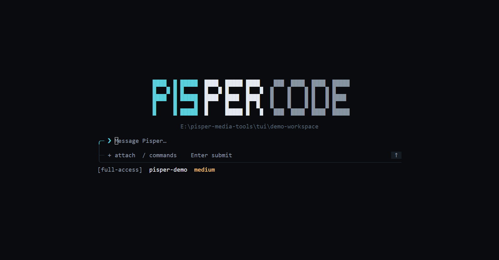

# Pisper TUI



[中文指南](./README.md)

## Install the Terminal Command

After installing the Pisper desktop app, open **Settings → Terminal** to install, repair, or uninstall the `pisper` command. Pisper installs it in a current-user directory and manages the matching `PATH` entry without administrator access.

Restart the terminal host after installing or uninstalling. Fully quit and reopen Windows Terminal, or restart the IDE that owns an integrated terminal.

To build the complete distribution from source:

```bash
npm run sidecar:sea
npm run tui:package
```

The output is written to:

```text
release/tui/pisper-<version>-<platform>-<arch>/
├── pisper[.exe]
├── pisper-sidecar[.exe]
└── sidecar-runtime/
```

## Startup and Sessions

Run Pisper from a project directory:

```bash
pisper
```

Plain `pisper` always creates an empty conversation. It never restores history automatically. Use `resume` explicitly to restore the most recent conversation for the current workspace:

```bash
pisper resume
pisper resume --cwd /path/to/project
```

Create a new conversation for another workspace:

```bash
pisper --cwd /path/to/project
```

Inspect sidecar, authentication, and capability status:

```bash
pisper doctor
```

The diagnostic output reports the sidecar connection source, TUI launch workspace, sidecar runtime fallback workspace, and the latest matching session workspace so directory inheritance failures are visible.

## Composer and Message Stream

- `Enter`: submit a message. Messages submitted during an active run enter a FIFO queue and are sent in order after the run finishes normally.
- `/`: open the combined list of runtime Tools, enabled Skills, and built-in commands.
- `Up` / `Down`: move through Slash, session, model, thinking-level, or file choices.
- `Tab`: complete the highlighted candidate only while the Slash list is open.
- `Esc`: close a picker, clear a Slash draft, or return from Events to Chat.
- `↑` / `↓`: scroll the conversation one row at a time; `PageUp` / `PageDown`: move eight rows. The TUI retains only the latest 100 messages so long sessions stay memory-bounded.
- `Home` / `End`, `Left` / `Right`, `Backspace` / `Delete`: edit the composer draft.
- `Ctrl+C`: abort the active or approval-blocked run; exit only while idle.

Long or multiline bracketed pastes render as a compact `[Pasted text · …]` token. The complete original text, including line breaks, is still submitted to the Agent. The token can be moved across or deleted as one unit.

## Built-in Commands

| Command | Action |
| :--- | :--- |
| `/init` | Analyze the current project and create or improve `AGENTS.md` at the workspace root. |
| `/new` | Create an empty conversation in the TUI launch workspace; unavailable during a run. |
| `/sessions` | Open the conversation picker; switching to another workspace requires a second confirmation and is unavailable during a run. |
| `/events` | Open the event ledger for the current TUI process. |
| `/chat` | Return to the Chat message stream. |
| `/model` | Open the model picker and switch the active session model; unavailable during a run. |
| `/thinking` | Refresh and open thinking levels supported by the active model; unsupported/error states explain why and can be retried. Unavailable during a run. |
| `/attach` | Open the workspace file picker. |
| `/mode` | Show the active execution mode and accepted values; it can be changed during a run. |
| `/mode read-only` | Expose low-risk analysis tools only. |
| `/mode workspace` | Read and write inside the workspace directly; approve every Shell command. |
| `/mode full-access` | Allow unrestricted local files, network, and Shell access. |
| `/quit` | Exit the TUI. |

Candidates are sorted by prefix match and local usage frequency. `Tab` completes a command without executing a Tool; press `Enter` to select a built-in command.

`/init` asks the Agent to inspect the project structure, commands, and conventions before writing repository-specific guidance instead of a fixed template. It carefully preserves useful content in an existing `AGENTS.md` and does not modify other project files. The command is unavailable in `read-only` mode; writes run directly without approval in `workspace` mode. After it completes, use `/new` to start a session that loads the generated project guidance at startup.

When the Agent creates a structured Plan, the TUI updates its items, owners, dependencies, and statuses in place between the transcript and Composer. Narrow terminals fold completed items and retain `Plan · completed/total` in the footer.

## Attachments

Open the attachment picker with any of these controls:

- type `+` while the composer is empty
- press `Ctrl+O`
- run `/attach`

File picker controls:

- `Up` / `Down`: select a file or directory.
- `Enter` / `Right`: enter a directory or add a file.
- `Left`: move to the parent without leaving the active workspace.
- `Delete`: remove the selected attachment.
- `Esc`: close the picker while preserving the composer draft.

The desktop attachment boundary is shared by the TUI: up to 8 files, 10 MiB per file, and 20 MiB total. Files must be workspace-local images, UTF-8 text/code, or supported documents. Images become visual input only when the active model explicitly supports images.

## Tools and Skills

After typing `/`, `T` marks runtime Tools and `S` marks enabled, model-invocable Skills.

Tool examples:

```text
/read README.md
/bash npm test
/web_search Pisper latest release
/mcp_pencil_get_editor_state_f9837b9b inspect the current Pencil canvas
```

The TUI sends the first Slash token through the structured `requestedToolNames` field. The Agent still generates arguments and performs the call. Slash selection never bypasses Tool settings, execution mode, workspace boundaries, or approval.

Skill example:

```text
/skill:docs-search find the Tauri updater signing requirements
```

The active Slash list is authoritative for Skill names. The runtime loads the matching `SKILL.md`, scripts, and references on demand. Tools invoked by a Skill follow the same permission chain.

## Approvals

In `workspace` mode, structured file reads and writes inside the workspace run directly. Only Shell commands require per-request approval. The approval panel temporarily replaces the composer:

- `Y`: Allow once.
- `N`: deny.
- `Esc`: deny.
- `Ctrl+C`: deny the pending request and abort the active run.

`read-only` does not expose write capabilities. `full-access` means the user explicitly allows unrestricted access; it is not a security sandbox.

## Local Development

Run from source in the current directory:

```bash
npm run tui:dev
```

Choose another workspace:

```bash
npm run tui:dev -- --cwd /path/to/project
```

Development runs `server/sidecar.mjs` by default. To connect an isolated running sidecar:

```text
PISPER_TUI_URL=http://127.0.0.1:<port>
PISPER_TUI_TOKEN=<desktop token>
```

Or specify a sidecar executable and runtime:

```text
PISPER_SIDECAR_PATH=/path/to/pisper-sidecar
PISPER_APP_ROOT=/path/to/sidecar-runtime
```

## Verification

```bash
npm run tui:test
npm run tui:check
cargo clippy --manifest-path src-tui/Cargo.toml --all-targets -- -D warnings
cargo build --manifest-path src-tui/Cargo.toml --release
```
